<div align="center">


# विश्वास · Vishwas

### AI‑Based Forecast Bust Detection & Forecast Trust Console for NCMRWF's Medium‑Range Forecasts

*"पूर्वानुमान पर विश्वास, परिणाम से पहले" — trust in the forecast, before the outcome.*

[](#1-the-problem-in-one-paragraph)
[](#5-problem-statement-compliance-matrix)
[](#)
[](#)


**Team PowerPuff Squad**

</div>

<br/>

<p align="center">
  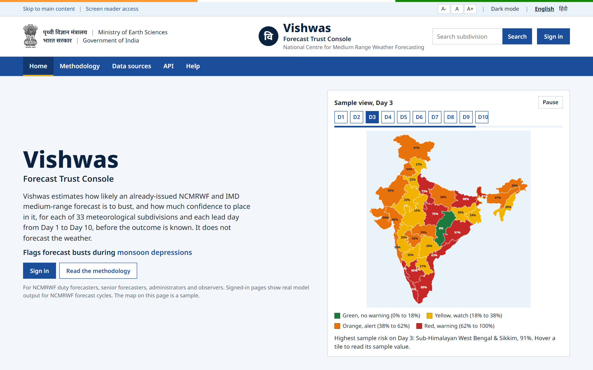
</p>

<p align="center">
  <em>The landing page. Vishwas does not forecast the weather: it rates how far an already-issued NCMRWF forecast<br/>can be trusted, for every one of India's 33 meteorological subdivisions and every lead day from Day 1 to Day 10.</em>
</p>

<br/>

---

## Table of contents

1. [The problem, in one paragraph](#1-the-problem-in-one-paragraph)
2. [Our solution, in one paragraph](#2-our-solution-in-one-paragraph)
3. [See it in action](#3-see-it-in-action)
4. [Why Vishwas: our USPs](#4-why-vishwas-our-usps)
5. [Problem statement compliance matrix](#5-problem-statement-compliance-matrix)
6. [Feature walkthrough](#6-feature-walkthrough)
7. [What counts as a bust](#7-what-counts-as-a-bust)
8. [Technical architecture](#8-technical-architecture)
9. [Tech stack](#9-tech-stack)
10. [Data](#10-data)
11. [Key algorithms](#11-key-algorithms)
12. [Results on unseen years](#12-results-on-unseen-years)
13. [Security, governance and integrity](#13-security-governance-and-integrity)
14. [Feasibility and viability](#14-feasibility-and-viability)
15. [Impact and benefits](#15-impact-and-benefits)
16. [Project structure](#16-project-structure)
17. [Getting started](#17-getting-started)
18. [API surface](#18-api-surface)
19. [Scaling roadmap](#19-scaling-roadmap)
20. [Team and credits](#20-team-and-credits)

> **The complete technical reference** (data pipeline, every feature, every endpoint with real responses, runbooks, presentation material and judge Q&A) is in **[docs/VISHWAS_HANDBOOK.md](docs/VISHWAS_HANDBOOK.md)**.

---

## 1. The problem, in one paragraph

Medium-range weather forecasts sometimes show large errors during rapidly evolving systems, such as:
- monsoon depressions;
- heavy rainfall events;
- western disturbances;
- cyclones;
- heat waves;
- break/active monsoon phases.

When such a forecast "busts", the cost falls on everyone downstream: disaster managers, farmers, reservoir operators, power and transport planners. Today a duty forecaster at NCMRWF has the forecast itself and the ensemble spread. What they do not have is a direct, calibrated, explained answer to the question that matters: ***"How likely is it that this particular forecast, for this region and this lead day, will be badly wrong?"*** Problem Statement 26079 asks for an AI/ML system that finds the regions and lead times where the forecast is likely to fail. It should compare current NWP forecast patterns with historical forecast error behaviour, and return:
- a forecast confidence map for Days 1 to 10;
- bust probabilities;
- error-prone areas;
- the meteorological reasons;
- an operational dashboard and API.

## 2. Our solution, in one paragraph

**Vishwas** is an AI system and government-grade web console that sits **on top of NCMRWF's issued forecast** and rates it before the outcome is known. It learns NCMRWF's own error behaviour from **23 years of NCMRWF forecasts checked against IMD's gridded observed rainfall**. It then scores every new forecast cycle for **all 33 IMD meteorological subdivisions × lead days 1–10**, which is 330 judgements in about one second. Each judgement contains:
- a **calibrated bust probability** (a stated 40% really busts about 40% of the time);
- a **forecast confidence map**;
- an **IMD colour-coded warning level with a recommended action**;
- a separate **big-miss watch** for very large rainfall errors;
- the **top meteorological reasons in plain language** (from exact TreeSHAP);
- the **closest historical case** and how it verified;
- a **model self-confidence** score that says how much precedent the model has.

Forecasters record what actually happened, senior forecasters approve those entries, and approved outcomes recalibrate the model. The system gets better the longer NCMRWF uses it.

---

## 3. See it in action

A walkthrough of the running product on real NCMRWF data. The forecast cycle shown is **1 December 2015**, the start of the Chennai floods.

<br/>

<p align="center">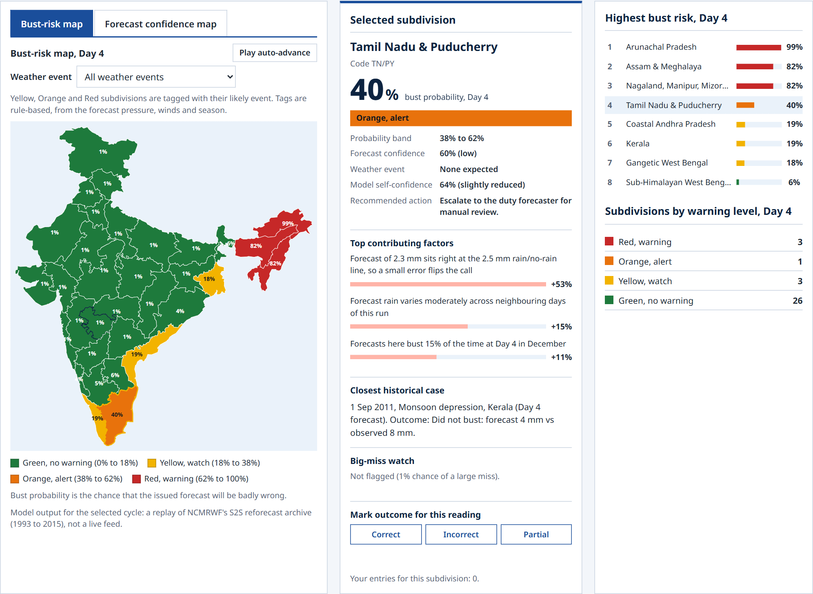</p>

### The dashboard: where will today's forecast fail, and why?

The operational heart of Vishwas, laid out in three columns:
- **Left: a geospatial bust-risk map of India** drawn from IMD's official subdivision boundaries, coloured on the IMD code (Green / Yellow / Orange / Red), with a Day 1 → Day 10 selector and animation.
- **Middle: the selected subdivision.** Here it is Tamil Nadu & Puducherry at Day 4: **40%, Orange "Alert"**, with the recommended action *"Escalate to the duty forecaster for manual review."* The three **top contributing factors** follow, each a sentence built from real SHAP values. The first is *"Forecast of 2.3 mm sits right at the 2.5 mm rain/no-rain line, so a small error flips the call"* (+53%). The **closest historical case** and the **big-miss watch** complete the column.
- **Right: the highest-risk subdivisions** and the count of subdivisions at each warning level.

That day **did bust**, and Vishwas flagged it four days ahead.

<br/>

<p align="center">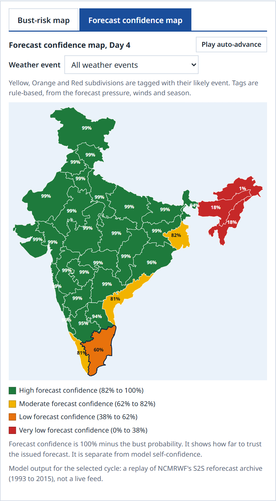</p>

### Forecast confidence map: region-wise confidence for Day 1 to Day 10

This is the exact first deliverable the problem statement asks for. One click switches the map from bust risk to **forecast confidence** (100% − bust probability). Pressing play animates the confidence field from Day 1 to Day 10, so a forecaster sees at a glance where and when the forecast stops being trustworthy. Every region carries a text label and an ARIA description, so colour is never the only signal.

<br/>

<p align="center">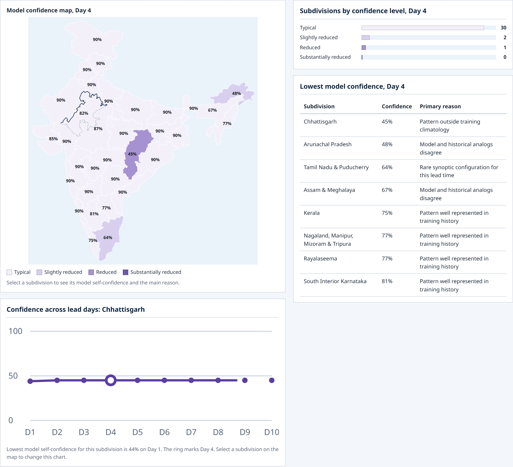</p>

### Model Trust: where the AI itself has less precedent

A second, independent axis that most AI systems never show: **how much the model trusts itself**. It combines four reliability flags:
- sparse history;
- an unfamiliar synoptic pattern;
- inputs outside the training range;
- disagreement with historical analogs.

These produce a self-confidence score and a primary reason, such as *"Pattern outside training climatology"*. The page has a violet map (deliberately never the warning colours), the distribution across levels, a trend across lead days for any subdivision, and a ranked table of the least-confident areas. Together they give error-prone area detection at the level of the model itself.

<br/>

<p align="center">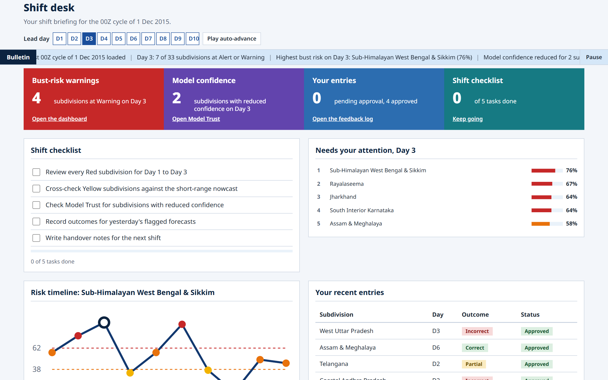</p>

### Role workspaces: the Shift desk

Every role lands on its own desk: **Shift desk** (duty forecaster), **Review desk** (senior forecaster), **Control room** (administrator) or **Briefing** (observer). The Shift desk turns the model output into a shift routine:
- a checklist (review every Red subdivision for Days 1–3, cross-check Yellow ones against the nowcast, check Model Trust, record yesterday's outcomes, write handover notes);
- today's attention list;
- a risk timeline.

<br/>

<p align="center">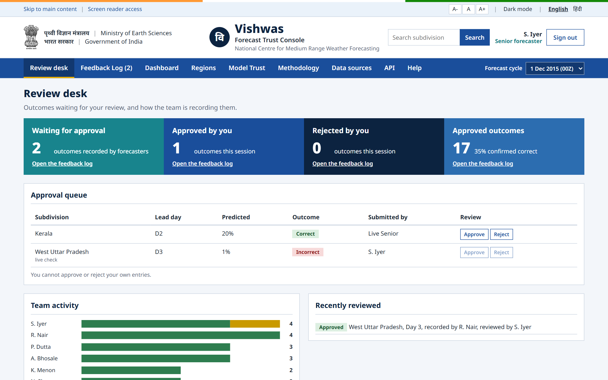</p>

### Feedback log: humans close the loop

Forecasters record what actually happened: correct, incorrect or partial. The server stamps each record with the model's prediction at that moment. **Senior forecasters approve or reject** entries (maker-checker: never their own). Only approved outcomes feed the model's recalibration, so the system learns from verified operational evidence rather than raw clicks.

<br/>

<p align="center">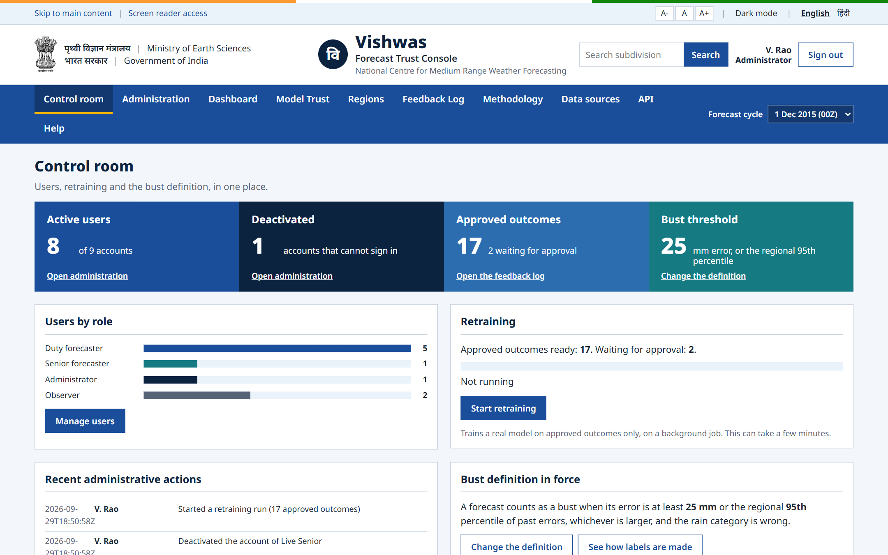</p>

### Administration: users, bust definition, retraining, audit

The Control room has four panels:
- **Users and roles:** add, change role, deactivate/reactivate.
- **Bust definition:** fixed error threshold and regional percentile.
- **Retraining:** a real background job with live stages (Preparing data → Training the model → Calibrating probabilities → Validating on held-out years). The maps keep serving while it runs, and the new model is swapped in with zero downtime.
- **Audit log:** every administrative action.

<br/>

<p align="center">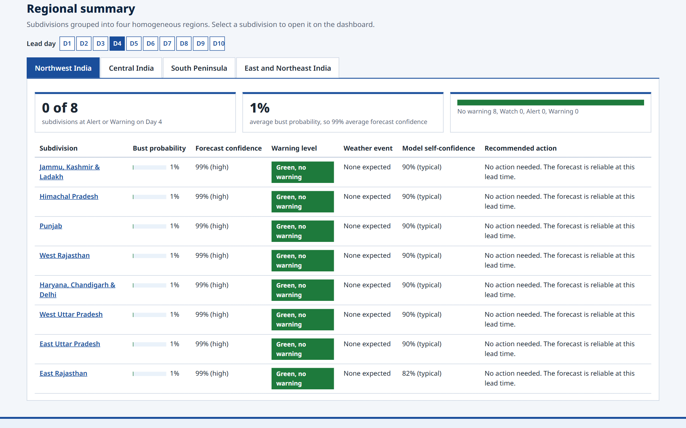</p>

### Regional summary

All 33 subdivisions grouped into IMD's four homogeneous regions (Northwest, Northeast, Central, South Peninsula). For each subdivision the table gives the bust probability, forecast confidence, warning level, weather event, model self-confidence and recommended action: a bulletin-ready view. Any row opens that subdivision on the dashboard.

<br/>

<p align="center">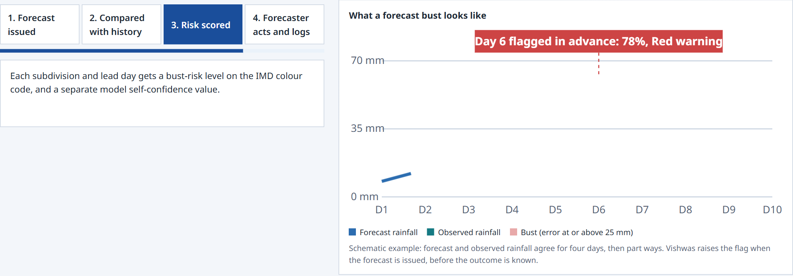</p>

### How it works, for the public

The landing page explains Vishwas in four steps (forecast issued → compared with history → risk scored → forecaster acts and logs). A large example chart replays itself: forecast and observed rainfall agree for four days and then part ways, and Vishwas raises its flag at issue time, before the outcome is known.

<br/>

<p align="center">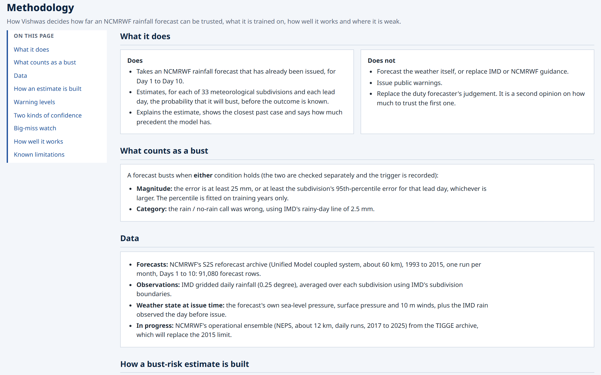</p>

### Methodology, data sources, API and help: open to everyone

Full-width documentation pages with an "On this page" contents list:
- what Vishwas does and does not do;
- the exact bust definition;
- the data and the four-step pipeline (interactive);
- an interactive warning-level slider;
- the two kinds of confidence and the big-miss watch;
- the held-out test results.

<br/>

### Built like a Government of India website

- State Emblem and Ministry of Earth Sciences header in Hindi and English.
- **English / हिंदी** interface.
- **A- / A / A+** text size, **dark mode**, and skip-to-content and screen-reader access.
- Full keyboard operation.
- A single clean navigation bar with the forecast-cycle picker built in.
- Responsive from a phone to a control-room display.

---

## 4. Why Vishwas: our USPs

| # | USP | Why it matters |
|---|---|---|
| 1 | **It forecasts the forecast's error, not the weather** | Vishwas adds a trust layer to what NCMRWF already issues, without replacing or duplicating the NWP chain. Adopting it changes no forecast; it tells forecasters which forecasts to double-check. |
| 2 | **Learned from NCMRWF's own history** | Trained on **23 years of NCMRWF's own forecasts** (1993–2015, the Unified Model coupled system) against IMD observations. It learns where, when and in which weather regimes *this* model goes wrong. NCMRWF's operational ensemble (**NEPS**, 2017–2025, via WMO TIGGE) is integrated as a second NCMRWF source. |
| 3 | **Calibrated probabilities you can write an SOP around** | Isotonic calibration on a held-out year, separately for coastal and inland regions: **calibration error 0.02** on unseen years. A stated 40% busts about 40% of the time, so the numbers can drive a standard operating procedure. |
| 4 | **Two-headed risk** | The main model covers every bust. A separate **big-miss head** targets the rare, costly large-amount errors and raises their detection from **41% to 75%** for only 2.5% more flags. |
| 5 | **Explainable in the forecaster's language** | Exact TreeSHAP contributions are grouped into meteorological factors and written as sentences with the real numbers, e.g. *"Forecasts here bust 15% of the time at Day 4 in December"*, with percentage and direction. |
| 6 | **Historical analogs with zero look-ahead** | For every case, the nearest past forecast situation (SHAP-weighted k-NN, same region preferred) and how it verified. Only cases whose outcome was known **before** the issue date are eligible. |
| 7 | **Model Trust: an honest second axis** | The AI reports its own confidence (four reliability flags) on a separate violet scale, so model uncertainty is never confused with forecast risk. |
| 8 | **Weather-event aware** | Every flagged subdivision is tagged with the system from the problem statement: monsoon depression, heavy rainfall event, western disturbance, cyclone, heat wave, or break/active monsoon phase. The dashboard filters by event. |
| 9 | **Human-in-the-loop continuous learning** | Record → senior approval (maker-checker) → recalibration → staged, zero-downtime model swap. The certified baseline model is never overwritten. |
| 10 | **Built on IMD standards end to end** | IMD subdivisions and official boundaries, the IMD colour code, IMD's 2.5 mm rainy-day and 64.5 mm heavy-rain thresholds, IMD gridded rainfall as truth, and a bilingual, accessible Government-of-India interface. |
| 11 | **Rigorous, leak-free validation** | Year-based splits, thresholds fitted on training years only, model selection on separate validation years, test years used once, block-bootstrap confidence intervals and automated leakage tests. |
| 12 | **Source-agnostic and lightweight** | The same pipeline trains on NCMRWF S2S, NCMRWF NEPS or NOAA GEFS, each with its own thresholds. It trains in about 30 s and scores a cycle in about 1 s on a CPU, with no GPU. |

## 5. Problem statement compliance matrix

Every item PS 26079 asks for, matched against what Vishwas implements:

| Problem statement requirement | Status | Where |
|---|---|---|
| AI/ML-based system | ✅ Built | LightGBM + coastal/inland isotonic calibration + big-miss head + TreeSHAP + analog k-NN, in `ml/vishwas_ml/` |
| Identify **regions** and **lead times** likely to have high uncertainty or large error | ✅ Built | 33 subdivisions × Day 1–10 = 330 scored combinations per cycle (`service.py → score`) |
| Compare **current NWP forecast patterns** with **historical forecast error behaviour** | ✅ Built | Trained on 23 years of NCMRWF forecast-vs-IMD errors; historical bust-rate features; analog search over past forecasts (`features.py`, `analogs.py`) |
| **Forecast confidence indicator** | ✅ Built | Forecast confidence = 1 − calibrated bust probability, on every subdivision and lead day |
| **Forecast confidence map**: region-wise confidence for Day 1 to Day 10 | ✅ Built | Geospatial India map with a D1–D10 selector and animation; `GET /api/v1/confidence-map` |
| **Forecast bust probability**: probability of large forecast error over different regions | ✅ Built | Calibrated per subdivision × lead (ECE 0.02); `GET /api/v1/bust-probability` |
| **Error-prone area detection** | ✅ Built | IMD warning levels, highest-risk ranking, level counts, big-miss watch, Model Trust; `GET /api/v1/big-miss`, `GET /api/v1/model-trust` |
| **Explainable output**: key meteorological reasons for low confidence | ✅ Built | Top 3 SHAP factors as plain sentences with % contribution, plus closest historical case; `GET /api/v1/subdivisions/{code}/explain` |
| Rapidly evolving systems: monsoon depressions, heavy rainfall, western disturbances, cyclones, heat waves, break/active monsoon | ✅ Built | Weather-event tag on every flagged subdivision + dashboard event filter (`events.py`) |
| **Prototype dashboard** for operational use | ✅ Built | Role-based web console: dashboard, regions, Model Trust, feedback log, administration, documentation (`frontend/`) |
| **Prototype API** for operational use | ✅ Built | FastAPI REST API, 20 routes, JWT auth, OpenAPI docs at `/docs` (`backend/`) |

---

## 6. Feature walkthrough

### For a duty forecaster (Shift desk)
- Pick the forecast cycle from the navigation bar; every page follows it.
- Read the **bust-risk map** or the **forecast confidence map** for any lead day, or animate Days 1–10.
- Select any subdivision for its probability, band, confidence, weather event, model self-confidence, recommended action, **top 3 reasons**, **closest historical case** and **big-miss watch**.
- Filter the map by weather event.
- Follow the shift checklist and the attention list.
- Record outcomes (correct / incorrect / partial) with an optional note.

### For a senior forecaster (Review desk)
- Everything a duty forecaster can do.
- Review the queue of pending outcomes, and approve or reject entries made by others (never their own).
- See team activity by forecaster and their own review history.

### For an administrator (Control room)
- Add users, set roles, deactivate and reactivate accounts (never themselves).
- Set the **bust definition**: the fixed error threshold (1–500 mm) and the regional percentile (50–99).
- **Start retraining**: a background job that retrains with the saved definition, recalibrates with approved outcomes and swaps the model in live.
- Read the **audit log** of every administrative action.

### For an observer (Briefing)
- A plain-language summary of the day and a snapshot of each region.
- Read-only access to every map, table and log.

### For everyone (no sign-in)
- The landing page with a sample map, how it works, and who uses Vishwas.
- **Methodology**, **Data sources** (with interactive "how a bust label is made" sliders), **API** explorer and **Help** (getting started, permissions table, glossary, accessibility).

## 7. What counts as a bust

A single, locked, auditable definition that matches operational practice:

```
magnitude bust : |forecast − observed| ≥ max( 25 mm , the subdivision's 95th-percentile error for that lead day )
category bust  : the rain / no-rain call was wrong at IMD's 2.5 mm rainy-day line
bust           : magnitude OR category          trigger recorded as magnitude / category / both
```

The percentile thresholds are fitted **on training years only**, separately for each forecast source. Administrators can change the 25 mm floor and the 95th percentile from the console, and the change takes effect at the next retraining.

**Warning levels (IMD colour code):**

| Level | Bust probability | Forecast confidence | Recommended action |
|---|---|---|---|
| 🟩 Green, no warning | 0–18% | 82–100% | No action needed. The forecast is reliable at this lead time. |
| 🟨 Yellow, watch | 18–38% | 62–82% | Cross-check the short-range nowcast before briefing. |
| 🟧 Orange, alert | 38–62% | 38–62% | Escalate to the duty forecaster for manual review. |
| 🟥 Red, warning | 62–100% | 0–38% | Escalate immediately. Treat the forecast with strong caution. |

---

## 8. Technical architecture

Vishwas is a deliberately simple, dependable three-tier system:
- a **static single-page web app**;
- a **stateless FastAPI service** that holds one trained model per process;
- **SQLite** for users, outcomes, settings, audit and jobs.

The ML engine is a Python package the API imports directly, so there is no model server to run or keep in sync.

```
   ┌──────────────────────────────────────────────────────────────────────────────────┐
   │                               DATA SOURCES                                         │
   │  NCMRWF S2S reforecasts      NCMRWF NEPS ensemble      IMD gridded       IMD sub-  │
   │  1993–2015 (RDS, NetCDF)     2017–2025 (TIGGE, GRIB2)  rainfall 0.25°    division  │
   │                                                        (imdlib)          shapefile │
   └───────────────┬───────────────────────┬──────────────────────┬────────────────┬────┘
                   ▼                       ▼                      │                │
   ┌──────────────────────────────────────────────────────────────┼────────────────┼────┐
   │  DATA PIPELINE   ncmrwf_s2s.py · ncmrwf_tigge.py             │                ▼    │
   │  decode → daily rain per lead → align to IMD day ──► area-weighted subdivision means│
   │                                                     (subdivision_weights.py)        │
   │                    ──► pairs table: issue date × subdivision × lead day ◄── IMD obs  │
   └───────────────────────────────────────┬──────────────────────────────────────────────┘
                                           ▼
   ┌──────────────────────────────────────────────────────────────────────────────────┐
   │  AI/ML ENGINE  (ml/vishwas_ml)                                                     │
   │   labels.py ─► features.py (35 issue-time features) ─► LightGBM ─► coastal/inland  │
   │   bust label     amount · rain line · lead consistency     classifier   isotonic   │
   │                  pressure · wind · moisture · history ·                calibration │
   │                  season · terrain/coast · recent rain         └─► big-miss head    │
   │   explain.py (TreeSHAP → sentences) · analogs.py (leak-free k-NN) · trust.py       │
   │   events.py (weather-event tags) · actions.py (IMD levels) · feedback.py (recal.)  │
   │                          ▼                                                          │
   │               VishwasService  — one method per endpoint, per-cycle cache            │
   └──────────────────────────┬───────────────────────────────────────────────────────┘
                              ▼
   ┌──────────────────────────────────────────────────────────────────────────────────┐
   │  BACKEND  (FastAPI, backend/)                                                      │
   │  ┌───────────────┐ ┌────────────────┐ ┌──────────────────┐ ┌────────────────────┐ │
   │  │ Auth: JWT +   │ │ ML routes      │ │ Outcomes + review │ │ Retraining job     │ │
   │  │ bcrypt, role  │ │ /api/v1/...    │ │ users · settings  │ │ background thread, │ │
   │  │ read from DB  │ │ maps · explain │ │ audit (SQLite)    │ │ staged model swap  │ │
   │  └───────────────┘ └────────────────┘ └──────────────────┘ └────────────────────┘ │
   └──────────────────────────┬───────────────────────────────────────────────────────┘
                              │  REST + JSON, Bearer token
                              ▼
   ┌──────────────────────────────────────────────────────────────────────────────────┐
   │  FRONTEND  (frontend/index.html + india_map.js)                                    │
   │  SVG map of India from IMD boundaries · dashboard · regions · Model Trust ·        │
   │  feedback log · administration · methodology · data sources · API · help           │
   │  English/हिंदी · dark mode · text size · keyboard + screen reader · mobile           │
   └──────────────────────────────────────────────────────────────────────────────────┘
```

**Request lifecycle:**
1. Sign in returns a 12-hour JWT.
2. The cycle picker loads `/api/v1/cycles`.
3. The whole cycle (10 lead days of maps, trust and big-miss) is preloaded and swapped in atomically.
4. Selecting a subdivision calls `bust-probability`, `explain` and `action`.
5. The server reads the user's role **from the database on every request** and calls `VishwasService`. That service scores the 330 rows of a cycle once (about 1 s) and serves every later call from cache.

## 9. Tech stack

### AI/ML (`ml/`)
| Layer | Choice |
|---|---|
| Language | Python 3.12 |
| Classifier | LightGBM 4.7 (gradient-boosted trees, early stopping on the calibration year) |
| Calibration | scikit-learn isotonic regression, fitted separately for coastal and inland subdivisions |
| Explainability | Exact TreeSHAP via LightGBM `pred_contrib`, verified against the `shap` library |
| Analogs | SHAP-weighted k-nearest neighbours with a no-look-ahead constraint |
| Data | pandas, NumPy, PyArrow/Parquet |
| Meteorological I/O | xarray + netCDF4 (NCMRWF S2S), ecCodes + cfgrib (TIGGE GRIB2), `imdlib` (IMD rainfall), `cdsapi` (ECMWF Data Store) |
| Geo | shapely + pyshp: grid-to-subdivision area weights from IMD's shapefile |
| Evaluation | PR-AUC, ROC-AUC, Brier skill, ECE, per-lead and per-subdivision reports, block-bootstrap CIs, Matplotlib plots |

### Backend (`backend/`)
| Layer | Choice |
|---|---|
| Web framework | FastAPI + Uvicorn, Pydantic validation, automatic OpenAPI docs |
| Database | SQLite (5 tables), standard SQL schema |
| Auth | PyJWT (HS256, 12 h tokens) + bcrypt password hashes |
| Jobs | Background thread with a process-wide lock, staged bundle swap |

### Frontend (`frontend/`)
| Layer | Choice |
|---|---|
| App | A single HTML file with vanilla JavaScript and hash routing: no build step, no framework, no runtime dependencies |
| Map | SVG of the 33 IMD subdivisions, generated from official boundaries by `frontend/tools/make_india_map.py` |
| Design | Government of India web conventions: State Emblem, MoES header, IMD colours, bilingual, accessible, dark mode, responsive |

### Quality
- **88 automated tests** (47 ML + 41 backend), covering:
  - bust-label logic and leakage guards;
  - the API contract, model behaviour and data readers;
  - every route and every role boundary.

## 10. Data

| Source | Role | Period | Rows / size |
|---|---|---|---|
| **NCMRWF S2S reforecast** (Unified Model coupled system, NCMRWF Research Data Server, DOI 10.64349/nmrf.rds.s2s.50521) | Primary forecast source: daily rain for Days 1–10 plus MSLP, surface pressure and 10 m winds | 1993–2015, 276 runs | **91,080** forecast rows |
| **NCMRWF NEPS** (operational global ensemble, WMO TIGGE, ~12 km) | Second NCMRWF source (`ncmrwf_neps` profile), daily runs; Day-1 rain correlates **0.91** with IMD | 2017–2025 | per-date subdivision files |
| **IMD gridded rainfall** (0.25°, Pai et al. 2014) | Observed truth, and rain on the day before issue | 1992–2025 | 409,827 subdivision-days |
| **IMD subdivision boundaries** (Indian_met_zones) | Grid → subdivision averaging and the map | — | 33 subdivisions |
| NOAA GEFSv12 + ERA5 | Independent comparison model | 2015–2019 | 602,580 rows |

**Lead days are aligned to IMD's day** (24 h ending 03Z) and verified by correlation against observations. The data model is one row per **(issue date, subdivision, lead day)**:
- forecast rain;
- observed rain;
- error;
- issue-time weather state;
- previous-day observed rain.

## 11. Key algorithms

- **Issue-time features (35).** All are known at 00Z on the issue date:
  - the forecast amount and its anomaly against climatology;
  - its distance from the 2.5 mm rain line;
  - consistency across neighbouring lead days;
  - run-to-run change and ensemble spread (when available);
  - regional rain regime;
  - pressure, moisture, temperature and wind anomalies (z-scored per subdivision × month);
  - pressure tendency;
  - previous-day observed rain;
  - the subdivision's historical bust rate for that lead and month (computed out-of-fold);
  - season;
  - terrain and coast.
- **Classifier and calibration.** LightGBM with early stopping on a held-out calibration year. Its scores are mapped to probabilities by isotonic regression on that same year, separately for coastal and inland subdivisions, and clipped to 1–99%.
- **Big-miss head.** A second calibrated LightGBM trained only on magnitude busts. Its flag threshold is chosen on the calibration year for 15% precision. It is shown alongside the main probability and never alters it.
- **Explanations.** Exact TreeSHAP contributions are summed into meteorological factor groups and rendered as sentences with the case's own values. The top three are shown with contribution percentage and direction.
- **Analogs.** k-NN per lead day in a SHAP-weighted feature space, preferring the same region, restricted to cases verified before the query's issue date.
- **Model self-confidence.** `u = 1 − (1 − 0.10) · Π(1 − wᵢ · flagᵢ)` over four flags (sparse history 0.6, unfamiliar pattern 0.6, out of range 0.5, analog conflict 0.45); self-confidence = 1 − u. The main reason is the flag contributing most.
- **Weather-event tags.** A transparent rules engine over each subdivision's candidate events (for example western disturbance in the northwest, cyclone on the coasts), choosing by pressure/moisture anomalies, forecast amount (IMD heavy rain ≥ 64.5 mm) and season.
- **Feedback recalibration.** Approved outcomes (`incorrect` = bust, `correct` = held, `partial` excluded) fit a second isotonic layer anchored on the calibration year, so a handful of entries cannot swing the model. It applies from 50 approved outcomes.

## 12. Results on unseen years

Held-out test years **2013–2015**, never seen in training or model selection: 11,880 forecasts, 1,976 busts (16.6%).

| Metric | **Vishwas** | Forecast amount alone | Climatology |
|---|---|---|---|
| **PR-AUC** [95% CI] | **0.541** [0.507, 0.584] | 0.452 | 0.272 |
| ROC-AUC | **0.864** | 0.835 | 0.682 |
| Brier skill vs climatology | **+0.230** | +0.171 | 0 |
| Calibration error (ECE) | **0.020** | | |
| Busts caught at Yellow or above | **90.4%** | | |
| Large misses caught (Alert or big-miss watch) | **74.8%** | | |

- **3.3×** the no-skill PR-AUC.
- **+0.091** PR-AUC over the forecast amount alone [+0.070, +0.114].
- The same method on NOAA GEFS (2019 test) gives **+0.042** [+0.035, +0.050] over forecast-only, so it generalises across forecast systems.
- **Best subdivisions (PR-AUC):**
  - Jammu, Kashmir & Ladakh 0.69
  - Arunachal Pradesh 0.65
  - Tamil Nadu & Puducherry 0.63
  - Himachal Pradesh 0.61

**Chennai floods, cycle of 1 December 2015 (out-of-sample):**
- **Tamil Nadu Day 1:** Yellow "Watch", prompting a cross-check on the flood day.
- **Day 4:** 40%, **Orange "Alert"**. It busted.
- **Day 5:** Yellow. It busted.
- **Neighbouring Coastal Andhra Pradesh and Rayalaseema** were forecast well and were rated Green.

<p align="center">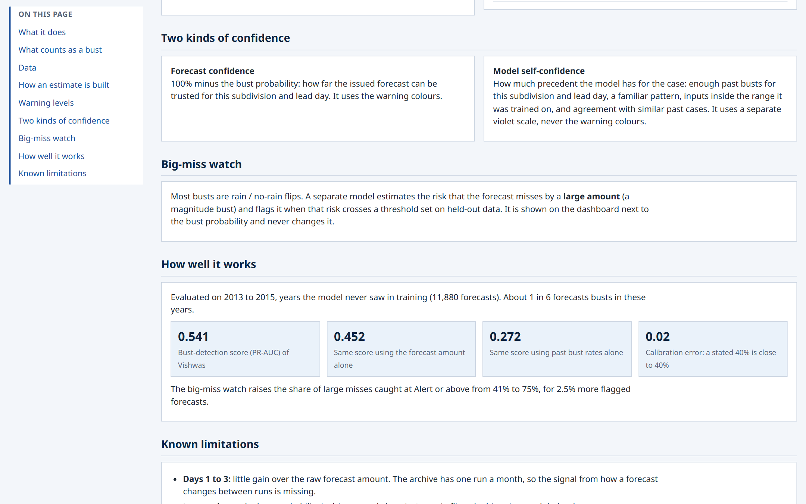</p>

## 13. Security, governance and integrity

- **Passwords:** bcrypt hashes, never stored or logged in plain text.
- **Tokens:** signed JWT bearer tokens (12 h); no cookies, so no cross-site credential exposure.
- **Role-based access, enforced on the server:** every route checks the role, and the role is **read from the database on every request**, so demotion or deactivation applies instantly, even to tokens already issued.
- **Maker-checker:** a senior forecaster cannot approve their own entry, and an administrator cannot deactivate themselves.
- **Audit log** of every administrative action: user changes, settings, retraining.
- **Certified baseline protection:** retraining writes to a separate runtime folder through a staged swap. The committed, evaluated model is never overwritten, and falling back to it is instant.
- **Input validation:** subdivision codes against the official 33, lead days 1–10, and settings within bounds. Errors are clean 401/403/404/409/422 responses.
- **Data integrity:** signed-in pages show model output only. A forecast cycle is loaded completely before it is displayed, so a screen is never half-updated.

---

## 14. Feasibility and viability

**Technical feasibility: built and running end to end.** Real NCMRWF data → trained, calibrated model → REST API → role-based web console, with 88 automated tests passing. Training takes about 30 seconds and scoring a full cycle about 1 second on an ordinary CPU. No GPU and no specialised infrastructure are needed.

**Operational feasibility: fits the existing workflow.** Vishwas consumes the forecast NCMRWF already produces and the observations IMD already publishes, both in-house at MoES. It speaks the forecaster's language: IMD subdivisions, the IMD colour code, IMD rainfall thresholds. Its four roles mirror how a forecasting desk already divides work.

**Data feasibility: proven on public NCMRWF archives.** NCMRWF's S2S reforecast archive (1993–2015) and its operational NEPS ensemble in WMO TIGGE (2017–2025) are both integrated through dedicated readers, verified lead-day alignment and committed grid-to-subdivision weights. Any further NCMRWF model (such as NCUM-G) needs only a reader.

**Financial feasibility: open by construction.** An entirely open-source stack, open data licences, no per-seat cost, and a two-process deployment (API + static site) on a single modest server.

**Sustainability: it improves with use.** Every approved outcome makes the model better calibrated for NCMRWF's current system. Retraining is one click for an administrator, with zero downtime.

| Challenge | How Vishwas handles it |
|---|---|
| Access to NCMRWF forecast archives | NCMRWF S2S (RDS portal) and NEPS (TIGGE) integrated with dedicated readers |
| Aligning forecasts with observations in time | Lead days mapped to IMD's 03Z day and verified by correlation (S2S Day-1 0.77, NEPS Day-1 0.91) |
| Busts are rare (~17%) | PR-AUC as the main metric, calibrated probabilities, a dedicated big-miss head |
| Information leakage | Issue-time features only, out-of-fold history, look-ahead-free analogs, automated leakage tests |
| Over-fitting | Year-based splits, separate validation years for selection, test used once, bootstrap CIs |
| Coastal, hill and plains regimes | Coastal/inland calibration, terrain and coast features, per-subdivision thresholds |
| Forecaster trust in AI | Plain-language SHAP reasons, historical analogs, Model Trust, calibration proven on unseen years |
| Keeping the model current | Approved-outcome recalibration and admin retraining with a staged, zero-downtime swap |

## 15. Impact and benefits

Medium-range rainfall guidance drives decisions worth crores every week: crop sowing and irrigation, reservoir releases, flood preparedness, power demand, transport and public events. A forecast that is trusted when it should not be, or doubted when it should be trusted, costs money and can cost lives. Vishwas gives every forecast a calibrated, explained confidence **at issue time**, so the forecaster's attention goes exactly where the forecast is most likely to fail.

| Stakeholder | What changes |
|---|---|
| **NCMRWF and IMD forecasters** | A map read in seconds shows which subdivisions and lead days need a second look. 90% of busts fall at Yellow or above, and every flag comes with its reasons, a past case and a recommended action. |
| **Disaster management authorities** | Warnings arrive with a confidence level, so preparedness can be scaled to how reliable the forecast actually is, especially for heavy rain, floods and cyclones. |
| **Farmers and Agromet advisory units** | Sowing, irrigation, spraying and harvest advisories can say how far to rely on the forecast, which reduces losses from both false alarms and misses. |
| **Reservoir, power and transport operators** | They can act on a trustworthy forecast and hedge on an uncertain one. |
| **Social** | Better-qualified warnings protect lives and livelihoods, and honest confidence information builds public trust in official forecasts. |
| **Economic** | Fewer costly decisions taken on unreliable forecasts, and better use of reliable ones. |
| **Environmental** | Better-timed irrigation and reservoir decisions save water, and better-trusted heavy-rain guidance reduces flood damage. |
| **Institutional** | Every approved outcome builds a verified record of forecast performance by region, season and lead day, and per-subdivision SHAP factors show NWP developers where and why the model errs. |

---

## 16. Project structure

```
sih2026-forecast-bust-detection/
├── frontend/                      The web console
│   ├── index.html                 Whole app: pages, styles, logic, English/हिंदी text
│   ├── india_map.js               SVG paths of the 33 IMD subdivisions (generated)
│   ├── assets/                    State Emblem
│   └── tools/make_india_map.py    Regenerates the map from IMD boundaries
├── backend/                       FastAPI + SQLite
│   ├── app.py                     App, CORS, error handlers, /health
│   ├── auth.py                    JWT + bcrypt, role checks (role read from DB)
│   ├── db.py · schema.sql         Database, schema, seed users
│   ├── service_registry.py        One VishwasService per process; runtime vs baseline model
│   ├── jobs.py                    Background retraining with staged swap + recalibration
│   ├── routers/                   auth · ml · outcomes · users · settings · retraining · audit
│   └── tests/                     41 tests
├── ml/                            AI/ML engine
│   ├── config.json                Sources, bust definition, splits, model settings
│   ├── vishwas_ml/                schema · labels · splits · features · model · pipeline ·
│   │                              evaluation · explain · analogs · trust · events · actions ·
│   │                              feedback · service · ncmrwf_s2s · ncmrwf_tigge · subdivision_weights
│   ├── scripts/                   train · evaluate · demo_api · build_s2s_pairs · build_neps_pairs ·
│   │                              fetch_tigge_ncmrwf · download_imd · recalibrate · sync_subdivisions
│   ├── models/                    Trained bundles per source (ncmrwf, gefs, synthetic)
│   ├── data/                      Pairs tables, subdivision list, grid weights, NEPS parts, IMD tables
│   ├── experiments/               Model-improvement harness and results
│   └── tests/                     47 tests
├── data/                          GEFS + ERA5 + IMD comparison-track pipeline, subdivision GeoJSON
└── docs/
    ├── VISHWAS_HANDBOOK.md        Complete technical handbook
    ├── screenshots/               The images in this README
    └── history/                   Project notes and handoffs
```

## 17. Getting started

```bash
# 1. Install (Python 3.12; on Linux/macOS use .venv/bin/ instead of .venv/Scripts/)
git clone https://github.com/Tanish-Shitanshu/sih2026-forecast-bust-detection.git
cd sih2026-forecast-bust-detection/ml
python -m venv .venv
.venv/Scripts/pip install -r requirements.txt -r ../backend/requirements.txt

# 2. Backend API: http://localhost:8000  (interactive docs at /docs)
cd ../backend
../ml/.venv/Scripts/python -m uvicorn app:app --port 8000

# 3. Website (separate terminal): http://localhost:5500
cd frontend
../ml/.venv/Scripts/python -m http.server 5500
```

Demo accounts (password `vishwas123` for all):

| User ID | Role |
|---|---|
| `forecaster` | Duty forecaster |
| `senior` | Senior forecaster |
| `admin` | Administrator |
| `observer` | Observer |

```bash
# Tests
cd ml && .venv/Scripts/python -m pytest -q tests                 # 47 ML tests
cd .. && ml/.venv/Scripts/python -m pytest -q backend/tests       # 41 backend tests

# Retrain / evaluate from the command line
cd ml && .venv/Scripts/python scripts/train.py --source ncmrwf && .venv/Scripts/python scripts/evaluate.py --source ncmrwf
```

## 18. API surface

All routes are under `/api/v1`, with a Bearer token from `/api/v1/auth/login`. Full request and response examples are in the [handbook](docs/VISHWAS_HANDBOOK.md#10-backend-and-rest-api).

| Route | Roles | Purpose |
|---|---|---|
| `POST /auth/login` | public | Sign in, receive a token |
| `GET /cycles` | all | Available forecast cycles |
| `GET /confidence-map?lead_day&cycle` | all | Bust probability, confidence, level and event for all 33 subdivisions |
| `GET /bust-probability?subdivision&lead_day&cycle` | all | One subdivision: probability, band, confidence, action, self-confidence |
| `GET /subdivisions/{code}/explain?lead_day&cycle` | all | Top meteorological reasons + closest historical case |
| `GET /model-trust?lead_day&cycle` | all | Model self-confidence with reasons, least confident first |
| `GET /analogs?subdivision&lead_day&cycle&k` | all | k most similar past cases |
| `GET /big-miss?lead_day&cycle` | all | Big-miss probability and flag per subdivision |
| `GET /action?subdivision&lead_day&cycle` | all | Level, action, trust note, big-miss watch |
| `POST /outcomes` · `GET /outcomes` | record: duty, senior · list: all | Record and list outcomes |
| `POST /outcomes/{id}/review` | senior | Approve or reject (not own entries) |
| `GET/POST /users` · `PATCH /users/{id}` | admin | Manage users and roles |
| `GET/PUT /settings/bust-definition` | read: all · write: admin | Bust definition |
| `POST /retraining` · `GET /retraining/{job_id}` | admin | Start and monitor retraining |
| `GET /audit` | admin | Administrative audit log |
| `GET /health` | public | Service status, model version, latest cycle |

## 19. Scaling roadmap

- **Live operational feed:** connect NCMRWF's daily NCUM-G and NEPS output directly, so every new cycle is scored as soon as it is issued.
- **District-level trust:** the same pipeline with district boundaries, for district-level warnings.
- **More variables:** temperature (heat and cold waves) and wind (cyclones), with the same bust, calibration and explanation machinery.
- **Deployment at MoES:** a containerised API behind the MoES network, PostgreSQL for the operational database, and single sign-on with government identity services.
- **Bulletin integration:** confidence statements attached automatically to IMD/NCMRWF bulletins and the Agromet advisory flow.

## 20. Team and credits

<div align="center">

Built by **Team PowerPuff Squad** for Smart India Hackathon 2026, Problem Statement 26079 (Ministry of Earth Sciences / NCMRWF).

AI/ML engine · NCMRWF data pipeline · Calibration, explainability, analogs and Model Trust · Model validation
Backend API · Authentication and roles · Web console · Geospatial map · GEFS + ERA5 comparison dataset

*Data: NCMRWF Research Data Server (S2S reforecasts, CC-BY), WMO TIGGE via ECMWF (NCMRWF NEPS), India Meteorological Department (gridded rainfall and subdivision boundaries).*

</div>
