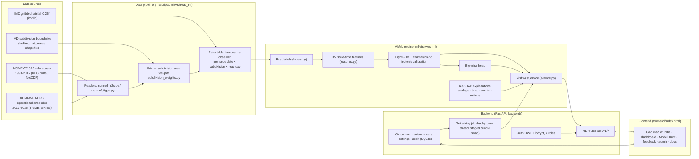

# Vishwas: Forecast Trust Console, Complete Handbook

**Smart India Hackathon 2026 · Problem Statement 26079 · AI-Based Forecast Bust Detection for Medium-Range Weather Forecasts**
**Organisation:** Ministry of Earth Sciences (MoES) · **Department:** National Centre for Medium Range Weather Forecasting (NCMRWF) · **Category:** Software
**Team:** PowerPuff Squad · **Repository:** https://github.com/Tanish-Shitanshu/sih2026-forecast-bust-detection (branch `main`)

This document is the single reference for the whole project: the problem, the idea, the data, the AI/ML, the website, the backend, the API, how to run everything, how to extend it, and the material for every slide of the SIH idea presentation. A new team member should be able to work on any part of the project from this file alone.

---

## Contents

1. [Summary in one page](#1-summary-in-one-page)
2. [The problem statement and how Vishwas answers every point](#2-the-problem-statement-and-how-vishwas-answers-every-point)
3. [Proposed solution, innovation and uniqueness](#3-proposed-solution-innovation-and-uniqueness)
4. [Who uses Vishwas: roles and workflow](#4-who-uses-vishwas-roles-and-workflow)
5. [System architecture](#5-system-architecture)
6. [Data](#6-data)
7. [AI/ML engine](#7-aiml-engine)
8. [Results](#8-results)
9. [The website, page by page](#9-the-website-page-by-page)
10. [Backend and REST API](#10-backend-and-rest-api)
11. [Repository layout](#11-repository-layout)
12. [Setup, running and testing](#12-setup-running-and-testing)
13. [Runbooks: common tasks](#13-runbooks-common-tasks)
14. [Technology stack](#14-technology-stack)
15. [Feasibility and viability](#15-feasibility-and-viability)
16. [Impact and benefits](#16-impact-and-benefits)
17. [Research and references](#17-research-and-references)
18. [Presentation guide (SIH idea PPT, slide by slide)](#18-presentation-guide-sih-idea-ppt-slide-by-slide)
19. [Anticipated judge questions](#19-anticipated-judge-questions)
20. [Appendices](#20-appendices)

---

## 1. Summary in one page

**What it is.** Vishwas ("trust" in Hindi) is an AI system and web console that tells NCMRWF forecasters **how far to trust a medium-range rainfall forecast, before the outcome is known**. For each of India's **33 meteorological subdivisions** and each **lead day from Day 1 to Day 10**, it gives:

| Output | What it means |
|---|---|
| **Bust probability** | Calibrated probability that the issued forecast will have a large error (a "bust"). A stated 40% busts about 40% of the time. |
| **Forecast confidence** | 100% minus the bust probability, shown on a confidence map for Days 1 to 10. |
| **Warning level** | Green / Yellow / Orange / Red on the IMD colour code, with a recommended action. |
| **Big-miss watch** | A separate flag for the risk of a very large miss in rainfall amount. |
| **Explanation** | The top meteorological reasons for the risk, in plain language (from SHAP). |
| **Closest historical analog** | The most similar past forecast situation and how it verified. |
| **Model self-confidence** | How much precedent the model has for this case, with the main reason. |
| **Weather-event tag** | The kind of system involved: monsoon depression, heavy rainfall event, western disturbance, cyclone, heat wave, or break/active monsoon phase. |

**How it works.** Vishwas learns from **23 years of NCMRWF's own forecasts (1993–2015)** checked against **IMD gridded observed rainfall**. It compares the current forecast pattern with how similar forecasts erred in the past, using a LightGBM model with calibrated probabilities. The NCMRWF operational ensemble (**NEPS, 2017–2025, via the WMO TIGGE archive**) is integrated as a second NCMRWF source through its own reader, downloader and training profile.

**How well it works.** On held-out years it never saw (2013–2015, 11,880 forecasts):
- **PR-AUC 0.541**, against 0.452 for the forecast amount alone and 0.272 for climatology (95% confidence intervals do not overlap);
- **ROC-AUC 0.864**;
- **calibration error 0.02**;
- **Brier skill score +0.23** over climatology.

With the big-miss watch, **75% of large misses are caught**.

**How people use it.** A secure, bilingual (English/Hindi), accessible, mobile-friendly website with four roles:
- **Duty forecaster:** reads the maps and records outcomes.
- **Senior forecaster:** approves the recorded outcomes.
- **Administrator:** manages users, the bust definition and retraining.
- **Observer:** views only.

Approved outcomes recalibrate the model, so it keeps improving in operation.

**Stack:** Python, LightGBM, SHAP, scikit-learn, pandas/xarray, FastAPI, SQLite, JWT + bcrypt, and a single-file HTML/CSS/JavaScript frontend with an SVG map of India drawn from IMD subdivision boundaries.

---

## 2. The problem statement and how Vishwas answers every point

### 2.1 Official text (PS 26079)

> **Problem Statement:** Medium-range weather forecasts sometimes show large errors during rapidly evolving systems such as monsoon depressions, heavy rainfall events, western disturbances, cyclones, heat waves and break/active monsoon phases.
>
> **Challenge:** The challenge is to develop an AI/ML-based system that can identify regions and lead times where the forecast is likely to have high uncertainty or large error. The system should compare current NWP forecast patterns with historical forecast error behaviour and provide a forecast confidence indicator.
>
> **Expected Outcome:**
> - Forecast confidence map: region-wise confidence for Day 1 to Day 10 forecasts
> - Forecast bust probability: probability of large forecast error over different regions
> - Error-prone area detection: identification of areas where model forecast may be unreliable
> - Explainable output: key meteorological reasons for low confidence
> - Prototype dashboard/API: simple interface for operational use

### 2.2 Requirement-by-requirement mapping

| PS requirement | What Vishwas delivers | Where to see it |
|---|---|---|
| AI/ML-based system | LightGBM gradient-boosted classifier + coastal/inland isotonic calibration + separate big-miss model + TreeSHAP explanations + k-NN analog search | `ml/vishwas_ml/` |
| Identify **regions** and **lead times** with high uncertainty or large error | A probability for every one of the 33 IMD subdivisions × 10 lead days (330 values per forecast cycle) | Dashboard map, Regional summary, Model Trust |
| **Compare current NWP forecast patterns with historical forecast error behaviour** | Trained on 23 years of NCMRWF forecast-vs-IMD errors. Features include historical bust rate for the subdivision × lead × month, climatological wet-day frequency, and the forecast's position relative to the rain line. Analog search retrieves the most similar past forecasts and how they verified. | "Closest historical case" on the dashboard; `GET /api/v1/analogs` |
| **Forecast confidence indicator** | Forecast confidence = 1 − bust probability, per subdivision and lead day | Dashboard, "Forecast confidence map" tab |
| **Forecast confidence map, Day 1 to Day 10** | Geospatial map of India (IMD subdivision boundaries) with a Day 1 … Day 10 selector and animation | Dashboard, `GET /api/v1/confidence-map` |
| **Forecast bust probability** | Calibrated probability per subdivision (a stated 40% busts ~40% of the time; calibration error 0.02) | Dashboard card, `GET /api/v1/bust-probability` |
| **Error-prone area detection** | Warning levels (Green/Yellow/Orange/Red), the "Highest bust risk" ranking, warning-level counts, the big-miss watch, and Model Trust (areas where the model itself has less precedent) | Dashboard right column, Model Trust page, `GET /api/v1/big-miss`, `GET /api/v1/model-trust` |
| **Explainable output: key meteorological reasons** | Top 3 factors per subdivision and lead, from exact TreeSHAP contributions grouped into meteorological factors and phrased as sentences (e.g. "Forecast of 2.3 mm sits right at the 2.5 mm rain/no-rain line, so a small error flips the call"), with percentage contribution and direction | Dashboard "Top contributing factors", `GET /api/v1/subdivisions/{code}/explain` |
| Rapidly evolving systems (monsoon depressions, heavy rainfall, western disturbances, cyclones, heat waves, break/active monsoon) | Every flagged subdivision is tagged with its likely weather event from these six. The dashboard can filter by event. | Dashboard "Weather event" filter |
| **Prototype dashboard/API for operational use** | Full web console with sign-in, 4 roles, maps, explanations, outcome logging, approvals, administration and retraining, plus a documented REST API (FastAPI, OpenAPI at `/docs`) | `frontend/`, `backend/` |

---

## 3. Proposed solution, innovation and uniqueness

### 3.1 The idea

A forecast is only as useful as the trust placed in it. NWP ensembles give spread, but forecasters still have no direct, calibrated, explained answer to the question **"How likely is it that this particular forecast, for this region and this lead day, will be badly wrong?"**

Vishwas answers exactly that question. It sits **on top of** NCMRWF's existing forecast. It does not replace the forecast; it rates it.

### 3.2 How it addresses the problem

1. **It learns NCMRWF's own error behaviour.** The model is trained on NCMRWF's forecasts and IMD's observations, so it learns where and when *this* model tends to go wrong: by region, lead day, season, rainfall regime and synoptic state.
2. **It delivers at issue time.** Every input is known when the forecast is issued (00Z), so the warning arrives in time to act on it. Leakage tests enforce this.
3. **It gives a probability, not a score.** Isotonic calibration on a held-out year makes the numbers mean what they say. That is what lets forecasters use them in a standard operating procedure.
4. **It explains itself.** Each probability comes with its top reasons, the closest past case and a model self-confidence value, so forecasters can judge the judgement.
5. **It closes the loop.** Forecasters record outcomes and seniors approve them. Approved outcomes recalibrate the model through an admin-triggered retraining job.

### 3.3 Innovation and uniqueness

- **Forecast-of-the-forecast.** It predicts the *error* of an operational forecast, rather than making another forecast.
- **Locked, auditable bust definition** that matches operational practice:
  ```
  bust = |forecast − observed| ≥ max(25 mm, subdivision's 95th-percentile error for that lead day)
         OR the rain / no-rain call was wrong at IMD's 2.5 mm rainy-day line
  ```
  The trigger (magnitude / category / both) is recorded. The thresholds are fitted on training years only, separately per forecast source. Administrators can change the definition from the console.
- **Two-headed risk.** The main model covers all busts. A separate "big-miss" head covers large magnitude errors, which are rarer but costlier, and raises their detection from 41% to 75% for only 2.5% more flags.
- **Model Trust, a separate axis.** Vishwas reports how much precedent it has for each case, using four reliability flags, on a different colour scale from the warning colours so the two are never confused.
- **Region-aware calibration.** Coastal and inland subdivisions get separate calibration, and terrain/coast features capture orographic and coastal rain regimes.
- **Built for Indian operations.** It uses IMD subdivisions and boundaries, the IMD colour code, IMD's rainy-day threshold, a bilingual interface, government-standard accessibility, and the government website look (MoES emblem, GIGW-style layout).
- **Human-in-the-loop governance.** Four roles, maker-checker approval (no self-approval), an audit log, role checks on every request, and retraining that never overwrites the certified baseline model.
- **Source-agnostic pipeline.** The same pipeline trains on NCMRWF S2S reforecasts, the NCMRWF NEPS operational ensemble (TIGGE) or NOAA GEFS, each with its own thresholds and model bundle.

---

## 4. Who uses Vishwas: roles and workflow

| Role | Workspace name | Can | Cannot |
|---|---|---|---|
| **Duty forecaster** (`duty`) | Shift desk | View every map and detail; record outcomes against flagged predictions; follow a shift checklist | Approve outcomes; manage users or settings |
| **Senior forecaster** (`senior`) | Review desk | Everything a duty forecaster can; approve or reject outcomes entered by others | Approve their own entries; manage users or settings |
| **Administrator** (`admin`) | Control room | Add users, set roles, deactivate/reactivate accounts; set the bust definition; start retraining; read the audit log | Record or approve outcomes; deactivate themselves |
| **Observer** (`observer`) | Briefing | View every map, table and log; plain-language day summary | Record, approve or change anything |

**Operational workflow (one forecast cycle):**
1. A new NCMRWF forecast cycle is issued, and Vishwas scores all 330 subdivision × lead-day combinations (about 1 second).
2. The **duty forecaster** opens the Shift desk and works through the checklist:
   - review every Red subdivision for Days 1–3;
   - cross-check Yellow ones against the nowcast;
   - check Model Trust;
   - record yesterday's outcomes;
   - write handover notes.
3. On the **dashboard** they select a subdivision to see why it is flagged: the factors, the closest past case, the big-miss watch and the recommended action.
4. After the valid date, the forecaster records the **outcome**: correct / incorrect / partial.
5. The **senior forecaster** approves or rejects it on the Review desk (never their own entry).
6. The **administrator** periodically starts **retraining**. The model retrains with the saved bust definition and is recalibrated with approved outcomes (applied once there are at least 50). The new bundle is swapped in live without downtime.

---

## 5. System architecture

### 5.1 High-level diagram



### 5.2 Components

| Layer | Folder | Responsibility |
|---|---|---|
| Data acquisition | `ml/scripts/fetch_tigge_ncmrwf.py`, `ml/scripts/download_imd.py`, `data/scripts/` | Download NCMRWF NEPS from TIGGE, IMD rainfall, GEFS/ERA5 (comparison track) |
| Data processing | `ml/vishwas_ml/ncmrwf_s2s.py`, `ncmrwf_tigge.py`, `subdivision_weights.py`, `ml/scripts/build_s2s_pairs.py`, `build_neps_pairs.py` | Decode NetCDF/GRIB, convert accumulations to daily rain, align lead days to IMD days, average over subdivisions, and build the pairs tables |
| ML core | `ml/vishwas_ml/` | Schema validation, labels, split, features, model, calibration, big-miss head, SHAP, analogs, trust, events, actions, feedback recalibration, evaluation |
| ML service | `ml/vishwas_ml/service.py` | One method per API endpoint, returning the exact frontend response shapes, with a per-cycle cache |
| Backend | `backend/` | FastAPI app: auth, roles, ML routes, outcomes/review, users, settings, audit, retraining jobs, SQLite |
| Frontend | `frontend/` | Single-page app (hash routing, vanilla JS), geo map, all pages, bilingual, accessible |
| Tests | `ml/tests/` (47), `backend/tests/` (41) | Label logic, leakage guards, API contract, model, readers, weights, every route and role boundary |

### 5.3 Request lifecycle (dashboard load)

1. The browser signs in with `POST /api/v1/auth/login` and receives a 12-hour JWT (bearer token, no cookies).
2. The frontend calls `GET /api/v1/cycles` and selects a cycle. The default is the latest one, `2015-12-01T00Z`.
3. For the selected cycle it preloads, for every lead day 1–10:
   - `confidence-map`
   - `model-trust`
   - `big-miss`

   It switches the view only when the whole cycle has loaded, so there is never a half-updated screen.
4. Selecting a subdivision calls:
   - `GET /api/v1/bust-probability`
   - `GET /api/v1/subdivisions/{code}/explain`
   - `GET /api/v1/action`
5. The backend checks the token and **reads the user's role from the database on every request**, so a role change or deactivation applies immediately. It then calls `VishwasService`.
6. `VishwasService.score(cycle)` scores all 330 rows once (about 1 s) and caches them. Every later call for that cycle is instant.

### 5.4 Design principles

- **No leakage.** Every feature is known at 00Z on the issue date, and `ml/tests/test_leakage.py` enforces it.
- **Held-out honesty.** Thresholds and the model are fitted on training years; calibration uses a separate year; evaluation uses unseen test years with block-bootstrap confidence intervals.
- **Separation of sources.** Each forecast source has its own thresholds, data file and model folder, and training refuses to overwrite another source's bundle.
- **Certified baseline is immutable.** Runtime retraining writes to `backend/runtime_models/` (staged, then swapped). The committed `ml/models/` is never written at runtime.
- **Real data everywhere a user signs in.** Signed-in pages never fall back to sample data. If a cycle fails to load, the console stays on the previous one.

---

## 6. Data

### 6.1 Sources

| Source | What | Period | Resolution | Access | Used for |
|---|---|---|---|---|---|
| **NCMRWF S2S reforecast** | NCMRWF's Unified Model coupled system (GC2/GA6, N216), Research Data Server, DOI 10.64349/nmrf.rds.s2s.50521, CC-BY | 1993–2015, init on the 1st of each month (276 runs) | ~60 km (0.833° × 0.556°) | https://rds.ncmrwf.gov.in/datasets/s2s-daily (free login) | Primary training data. Daily rainfall Day 1–10, plus the model's MSLP, surface pressure and 10 m winds |
| **NCMRWF NEPS** (operational global ensemble) | NCMRWF's operational medium-range ensemble, archived in WMO TIGGE | Aug 2017 – 2025, daily 00Z/12Z runs | ~12 km (0.12° grid) | ECMWF Data Store, dataset `tigge-forecasts`, `origin: ncmrwf` (free account + TIGGE licence) | Second NCMRWF source (`ncmrwf_neps` profile). Rain from total-precipitation differences, plus MSLP, surface pressure, 2 m temperature, 2 m dewpoint and 10 m winds at issue time |
| **IMD gridded rainfall** | IMD daily gridded rainfall (Pai et al. 2014) | 1901 → present (we use 1992–2025) | 0.25° | `imdlib` Python package | Observed rainfall (truth) and rain on the day before issue |
| **IMD subdivision boundaries** | Official meteorological subdivision polygons (`Indian_met_zones`, v2) | — | vector | github.com/India-Meteorological-Department/Indian_met_zones | Grid → subdivision averaging; the map in the website |
| NOAA GEFSv12 reforecast + ERA5 | Comparison track (independent model) | 2015–2019 | 0.5° / 0.25° | NOAA AWS, Copernicus CDS | Independent validation that the method generalises across forecast systems |

### 6.2 Spatial unit: 33 meteorological subdivisions

Vishwas uses **33 IMD meteorological subdivisions**, grouped into four regions: Northwest, Northeast, Central and South Peninsula (full list in [Appendix A](#appendix-a-the-33-subdivisions)). Gridded fields are averaged over each subdivision with **area weights**: the overlap area of each grid cell with the polygon × cos(latitude), built by `ml/vishwas_ml/subdivision_weights.py` for any regular grid.

Committed weight tables:
- `ml/data/weights_ncmrwf_s2s_n216.csv` (S2S grid, including the staggered wind grid);
- `ml/data/weights_ncmrwf_neps.csv` (NEPS grid, 16,065 rows).

### 6.3 Time alignment (verified against observations)

- **IMD day D** is the 24 hours ending 08:30 IST (03Z) on D.
- **S2S:** file `dayNN` is the 24 h after the 00Z init, so it pairs with IMD date init + NN + 1, i.e. **lead_day = NN + 1**. This was verified: day00 correlates 0.77 with IMD init+1, against 0.62 and 0.54 for the neighbouring days.
- **NEPS (TIGGE):** `tp` is accumulated from the start of the run, so rain for lead L = tp(24·L h) − tp(24·(L−1) h), paired with IMD date init + L. This was verified: Day-1 correlation with IMD is **0.91**.
- **Recent observed rain** feature = IMD rain on (issue date − 1). IMD's issue-date value would end 3 h after a 00Z issue, so it is not used.
- **Weather state:**
  - S2S uses the model's day-01 state (the portal has no analysis-time fields).
  - NEPS uses the step-0 analysis state at issue time.

### 6.4 The pairs table (model input)

One row per **(issue date, subdivision, lead day)**. Columns (the loader also accepts the data team's aliases; see `ml/vishwas_ml/schema.py`):

| Column | Meaning |
|---|---|
| `date` | Forecast issue date (00Z cycle) |
| `subdivision_code` | One of the 33 codes |
| `lead_day` | 1–10 |
| `forecast_rain_mm` | Subdivision-average forecast rain for the valid day |
| `observed_rain_mm` | Subdivision-average IMD rain for the valid day |
| `error_mm` | forecast − observed |
| `era5_msl_pa`, `era5_sp_pa`, `era5_t2m_k`, `era5_d2m_k`, wind columns | Issue-time weather state (from the NCMRWF model itself for NCMRWF sources; ERA5 only for the GEFS track) |
| `total_precipitation` | IMD rain on issue date − 1 |
| `forecast_rain_spread` (optional) | Ensemble standard deviation |
| `year` | For the year-based split |

**Datasets in the repo:**

| File | Rows | Notes |
|---|---|---|
| `ml/data/ncmrwf_pairs.parquet` | **91,080** | 276 NCMRWF S2S runs × 33 × 10, 1993–2015, 0 missing IMD |
| `ml/data/external/ncmrwf_fc_1993_2015.parquet` | — | Per-lead S2S subdivision fields (rain, pressure, winds) used by the experiment harness |
| `ml/data/external/imd_subdivision_daily_1992_2025.parquet` | 409,827 | IMD daily rain per subdivision, 1992–2025 |
| `ml/data/neps_parts/YYYYMMDD.parquet` | one file per issue date | NEPS subdivision fields: lead 0 = state, leads 1–10 = daily rain |
| `data/processed/bust_dataset.parquet` | 602,580 | GEFS + ERA5 + IMD comparison dataset, 2015–2019 |
| `ml/data/synthetic_pairs.parquet` | — | Synthetic data for pipeline tests |

### 6.5 Bust definition (locked; configurable by admin)

```
magnitude bust: |forecast − observed| ≥ max(min_error_mm = 25 mm,
                                             P95 of |error| for that subdivision × lead day, training years only)
category bust:  (forecast ≥ 2.5 mm) ≠ (observed ≥ 2.5 mm)        # IMD rainy-day threshold
is_bust = magnitude OR category;  trigger_reason ∈ {magnitude, category, both}
```

Configured in `ml/config.json → bust`. Administrators change `min_error_mm` (1–500) and `percentile` (50–99) from the console, and the change applies at the next retraining run. In 2013–2015, 16.6% of NCMRWF forecasts are busts.

---

## 7. AI/ML engine

All code is in `ml/vishwas_ml/`. The training entry point is `ml/scripts/train.py --source <source>`, which calls `pipeline.train_pipeline`.

### 7.1 Pipeline

```
load_pairs (schema.py, validates)
 → split by year (splits.py): train / calibration year / test years
 → fit bust thresholds on train only; label all rows (labels.py)
 → build 35 features (features.py); history features out-of-fold on train
 → LightGBM with early stopping on the calibration year (model.py)
 → isotonic calibration on the calibration year, separately for coastal and inland subdivisions
 → big-miss head: second LightGBM on magnitude busts, own calibration, flag threshold set for 15% precision on the calibration year
 → evaluate on test years with block-bootstrap CIs (evaluation.py)
 → save bundle to ml/models/<source>/ (booster, calibrators, features, analog index, metadata, evaluation/)
```

**Splits:**

| Source | Train | Calibrate | Test |
|---|---|---|---|
| `ncmrwf` | 1993–2011 | 2012 | 2013–2015 |
| `ncmrwf_neps` | 2017–2022 | 2023 | 2024–2025 |
| `gefs` | 2015–2017 | 2018 | 2019 |

### 7.2 Features (35, all known at issue time)

| Group | Features | Meteorological meaning |
|---|---|---|
| Lead | `lead_day` | Predictability decays with lead time |
| Amount | `forecast_rain`, `fc_log1p`, `fc_clim_ratio`, `fc_minus_rain_threshold` | Forecast rain, its anomaly against climatology, and its distance from the 2.5 mm rain/no-rain line |
| Run-to-run change | `fc_jump`, `fc_jump_abs`, `fc_jump_gap` | How much the forecast for the same valid day changed since the previous run (active with daily runs such as NEPS) |
| Lead consistency | `fc_neighbor_std` | How much the forecast varies across neighbouring lead days of the same run |
| Ensemble | `fc_spread`, `fc_spread_rel` | Ensemble spread, when available |
| Regional | `fc_region_mean`, `fc_region_dev` | Regional rain regime, and how the subdivision departs from it |
| Pressure | `mslp_z`, `surface_pressure_z`, `mslp_region_z`, `mslp_tendency` | Lows, depressions and pressure gradients (z-scored per subdivision × month) |
| Moisture | `dewpoint_z`, `dewpoint_depression`, `dewpoint_depression_z` | Moisture availability |
| Temperature | `temp_z` | Heat-wave regimes |
| Wind | `wind_u_z`, `wind_v_z`, `wind_speed_z` | Monsoon flow strength and direction, western disturbances |
| Recent rain | `era5_tp_rel` | Observed rain the day before issue (IMD), relative to climatology |
| History | `hist_bust_rate`, `bust_threshold_mm`, `clim_wet_frac` | The model's own historical error behaviour for this subdivision × lead × month (out-of-fold for training rows) |
| Season | `month_sin`, `month_cos`, `region_id` | Monsoon, post-monsoon, winter and pre-monsoon regimes |
| Location | `elevation_proxy_m`, `coastal`, `coastal_x_fc`, `elev_x_fc` | Orographic and coastal rain regimes (elevation from the model's own surface pressure) |

**Most important features (NCMRWF model, gain share):**
1. forecast amount;
2. distance from the rain line;
3. lead-day consistency;
4. climatological wet-day frequency;
5. regional rain mean;
6. lead day;
7. terrain × forecast;
8. anomaly against climatology.

### 7.3 Model and calibration

- **Classifier:** LightGBM. Settings are in `ml/config.json → lightgbm`:
  - `num_leaves` 31, learning rate 0.03, `min_child_samples` 50;
  - feature fraction 0.8, bagging fraction 0.8, L2 1.0;
  - up to 3,000 trees with early stopping (150 rounds) on the calibration year.
- **Calibration:** isotonic regression fitted on the calibration year, **separately for coastal and inland subdivisions** (`ClusterIsotonic`). Output is clipped to 1–99%.
- **Big-miss head:** a separate LightGBM plus isotonic model for magnitude busts. Its flag threshold is chosen on the calibration year for a 15% precision target (`config.json → big_miss.precision_target`). It is exposed as `GET /api/v1/big-miss` and `action.big_miss_watch`, and never changes the main probability.

### 7.4 Explanations (`explain.py`)

- **Exact TreeSHAP** contributions (LightGBM `pred_contrib`, verified against the `shap` library in tests).
- The contributions are grouped into meteorological factors and **phrased as sentences** with the actual values. Examples:
  - "Forecast of 2.3 mm sits right at the 2.5 mm rain/no-rain line, so a small error flips the call"
  - "Forecast rain varies moderately across neighbouring days of this run"
  - "Forecasts here bust 15% of the time at Day 4 in December"
- Each factor is returned with its contribution percentage and direction (`raises` / `lowers`); the top 3 are shown.

### 7.5 Historical analogs (`analogs.py`)

- k-nearest-neighbour search per lead day in a SHAP-weighted feature space, preferring the same region.
- It **only returns cases whose outcome was known before the query's issue date**, so there is no look-ahead.
- Each analog returns its date, the situation (weather event, subdivision, lead) and the verified outcome, for example "Did not bust: forecast 4 mm vs observed 8 mm".

### 7.6 Model self-confidence (`trust.py`)

Four reliability flags, each scored from 0 to 1:

| Flag | Reason shown |
|---|---|
| `sparse_history`: few past busts for this subdivision × lead | Sparse historical analog data |
| `unfamiliar`: nearest analogs unusually far away | Rare synoptic configuration for this lead time |
| `out_of_range`: inputs outside the training range | Pattern outside training climatology |
| `analog_conflict`: model disagrees with what analogs did | Model and historical analogs disagree |

Uncertainty `u = 1 − (1 − 0.10) · Π(1 − wᵢ·flagᵢ)` with weights 0.6 / 0.6 / 0.5 / 0.45, and self-confidence = 1 − u. The levels are Typical, Slightly reduced, Reduced and Substantially reduced. They use a violet scale, never the warning colours.

### 7.7 Weather-event tags (`events.py`) and actions (`actions.py`)

- **Events:** a transparent rules engine that picks, for each flagged subdivision, the best-supported event from its candidate set: western disturbance (NW), heat wave, cyclone (coastal), monsoon depression, heavy rainfall event (≥ 64.5 mm, IMD "heavy"), or break/active monsoon phase. It uses pressure/moisture anomalies, the forecast amount and the season.
- **Warning levels and actions:**

| Level | Bust probability | Forecast confidence | Recommended action |
|---|---|---|---|
| Green, no warning | 0–18% | 82–100% | No action needed. The forecast is reliable at this lead time. |
| Yellow, watch | 18–38% | 62–82% | Cross-check the short-range nowcast before briefing. |
| Orange, alert | 38–62% | 38–62% | Escalate to the duty forecaster for manual review. |
| Red, warning | 62–100% | 0–38% | Escalate immediately. Treat the forecast with strong caution. |

### 7.8 Continuous learning from forecasters (`feedback.py`)

- Outcome meaning: `incorrect` = the forecast busted, `correct` = it held, `partial` = excluded.
- Only **approved** outcomes are used. A second isotonic layer is anchored on the calibration year, so a handful of entries cannot swing the model. It applies from 50 approved outcomes (`config.json → feedback.min_outcomes`).
- Triggered by the administrator's retraining job, which retrains, recalibrates and swaps the bundle in live.

### 7.9 Validation protocol

- **Year-based split.** Thresholds, features and the model use training years only; calibration uses the next year; the test years are never seen.
- **Model selection** for improvements used separate validation years (train 1993–2008, calibrate 2009, validate 2010–2012), with the test years removed from the data before selection. The chosen variant was evaluated on test **once**. The harness is `ml/experiments/ncmrwf_improve.py`, and the results are in `ml/experiments/results/`.
- **Confidence intervals** use a block bootstrap over whole issue dates, and paired bootstraps for model comparisons.
- **Metrics:**
  - PR-AUC, the main metric, because busts are the minority class;
  - ROC-AUC, Brier score and Brier skill against climatology;
  - expected calibration error;
  - precision and recall at the Watch and Alert levels;
  - the same metrics per lead day and per subdivision (`ml/models/<source>/evaluation/`).

---

## 8. Results

### 8.1 NCMRWF model, held-out test years 2013–2015

11,880 forecasts (36 runs × 33 subdivisions × 10 lead days), 1,976 busts (16.6%).

| Metric | **Vishwas** | Forecast amount + lead only | Climatology |
|---|---|---|---|
| **PR-AUC [95% CI]** | **0.541 [0.507, 0.584]** | 0.452 | 0.272 |
| ROC-AUC | **0.864** | 0.835 | 0.682 |
| Brier skill vs climatology | **+0.230** | +0.171 | 0 |
| Expected calibration error | **0.020** | — | — |
| Precision / recall at Orange+ | 0.517 / 0.555 | 0.522 / 0.395 | 0.392 / 0.010 |
| Recall at Yellow+ | **0.904** | — | — |
| Accuracy at 0.5 | 0.857 | — | — |

- **Vishwas minus forecast-only:** +0.091 PR-AUC [+0.070, +0.114].
- **Vishwas vs chance:** PR-AUC 0.541 is **3.3×** the 0.166 no-skill level.
- **By lead day (PR-AUC):**

  | D1 | D2 | D3 | D4 | D5 | D6 | D7 | D8 | D9 | D10 |
  |---|---|---|---|---|---|---|---|---|---|
  | 0.489 | 0.545 | 0.471 | 0.557 | 0.579 | 0.495 | 0.486 | 0.555 | 0.631 | 0.594 |

- **Best subdivisions (PR-AUC):**
  - Jammu, Kashmir & Ladakh 0.69
  - Arunachal Pradesh 0.65
  - Tamil Nadu & Puducherry 0.63
  - Himachal Pradesh 0.61
- **Big-miss watch:** of 135 large-magnitude busts, the Orange+ alert catches 41.5%; **Alert or big-miss flag catches 74.8%**, for +2.5% extra flagged forecasts.

### 8.2 Demo event: Chennai floods, 1 December 2015 cycle (out-of-sample)

- **Tamil Nadu & Puducherry:**
  - Day 1: forecast 12.4 mm, observed 41.0 mm (subdivision average). Vishwas gives 18%, **Yellow "Watch"**, prompting a cross-check on the flood day.
  - Day 4: **40%, Orange "Alert"**. It did bust. Top reason: "Forecast of 2.3 mm sits right at the 2.5 mm rain/no-rain line, so a small error flips the call".
  - Day 5: Yellow. It did bust.
- **Neighbouring Coastal Andhra Pradesh and Rayalaseema** were forecast well, and Vishwas rated them Green: it discriminates between regions.

### 8.3 Independent comparison model (GEFS + ERA5, 2019 test)

On NOAA's GEFSv12 (602,580 rows) the same method gives PR-AUC **0.509** [0.495, 0.523] against 0.467 for forecast-only, a +0.042 gain [+0.035, +0.050]. The method generalises across forecast systems.

### 8.4 NCMRWF NEPS operational ensemble

The NEPS source is integrated end to end:
- the TIGGE reader;
- the monthly bulk downloader;
- the NEPS-grid subdivision weights;
- the pairs builder;
- the `ncmrwf_neps` training profile.

The rainfall read from NEPS matches IMD with **correlation 0.91 at Day 1**. Daily runs activate the run-to-run change features, and 12 km resolution resolves coastal and orographic rain. The runbook to (re)train it is in [§13.4](#134-train-the-ncmrwf-neps-model).

---

## 9. The website, page by page

**File:** `frontend/index.html`, a single-page app written in vanilla JavaScript with hash routing (`#/dashboard` and so on). `frontend/india_map.js` holds the India map geometry, and `frontend/assets/emblem_of_india.svg` the emblem.

**Backend address:** `API_BASE = "http://localhost:8000"` (near the top of the main script).

### 9.1 Global features

- **Government header:** State Emblem, "Ministry of Earth Sciences / Government of India" (bilingual), and the Vishwas name, "Forecast Trust Console" and "National Centre for Medium Range Weather Forecasting".
- **Utility bar:**
  - skip to main content;
  - screen reader access;
  - text size A- / A / A+;
  - **Dark mode** (remembered per browser);
  - **English / हिंदी**.
- **Single navigation bar**, role-aware (see `NAVSETS`). The **Forecast cycle** picker sits at the right of the bar and feeds every page.
- **Mobile friendly:**
  - under 860 px the navigation collapses into a Menu button;
  - all grids become one column;
  - there is no horizontal scrolling.
- **Accessibility:** keyboard operable; ARIA labels on every map region; a text label on every subdivision (name, value and level); colour is never the only signal; visible focus.
- **Geospatial map of India:** 33 IMD subdivision polygons drawn from `data/processed/subdivision_boundaries.geojson`, regenerated with `frontend/tools/make_india_map.py`. Each region shows its value, highlights on hover, and can be selected with click, Enter or Space.

### 9.2 Pages

| Route | Page | Who | Contents |
|---|---|---|---|
| `#/home` | **Home** | Everyone | Hero; notices ticker; sample bust-risk map with Day 1–10 animation; key facts (33 subdivisions, 10 lead days, 4 warning levels, 3 data sources); **How it works** (four steps with a large, self-replaying example of forecast vs observed rain); **Who uses Vishwas** (role tabs in government navy) |
| `#/login` | **Sign in** | Everyone | User ID + password; errors shown inline |
| `#/overview` | **Workspace** | Signed in | Role-specific desk (see below) |
| `#/dashboard` | **Dashboard** | Signed in | Lead day D1–D10; **Bust-risk map** / **Forecast confidence map** tabs; weather-event filter; play/pause animation; **selected subdivision card** (uniform layout; see below); **Highest bust risk** top 8; **Subdivisions by warning level** |
| `#/regions` | **Regional summary** | Signed in | Four homogeneous regions with a table for each: bust probability, confidence, level, event, self-confidence, action. Selecting a row opens that subdivision on the dashboard |
| `#/model-trust` | **Model Trust** | Signed in | **Model confidence map** (violet scale); subdivisions by confidence level; **confidence across lead days** chart for the selected subdivision; **lowest model confidence** table with the primary reason |
| `#/feedback` | **Feedback log** | Signed in | Log of outcomes with status, approved-outcomes chart by lead day; **Record an outcome** form (duty and senior); **Approve / Reject** (senior, not own entries) |
| `#/admin` | **Administration** | Admin | Users and roles (add, change role, deactivate/reactivate); **bust definition** (fixed threshold mm, regional percentile); **retraining** with live stages (Preparing data → Training the model → Calibrating probabilities → Validating on held-out years); **audit log** |
| `#/methodology` | **Methodology** | Everyone | What it does and does not do; what counts as a bust; data; the four steps (interactive); warning levels (interactive slider + table); two kinds of confidence; big-miss watch; how well it works |
| `#/sources` | **Data sources** | Everyone | NCMRWF forecast archive, IMD gridded rainfall, IMD subdivision boundaries; interactive "how a bust label is made" sliders |
| `#/api` | **API** | Everyone | Endpoint explorer: method, path, roles, parameters, example response |
| `#/help` | **Help** | Everyone | Getting started, roles and permissions table, glossary, accessibility |

**Role desks (`#/overview`):**
- **Shift desk (duty):**
  - shift checklist with progress;
  - subdivisions needing attention today;
  - risk timeline;
  - your recent entries.
- **Review desk (senior):**
  - approval queue;
  - team activity by forecaster;
  - review history.
- **Control room (admin):**
  - users by role and status;
  - retraining status;
  - approved outcomes ready for training;
  - recent administrative actions.
- **Briefing (observer):**
  - plain-language summary of the day;
  - snapshot of each region.

**Selected subdivision card (dashboard):**
- Name and code.
- Big bust probability with its level chip.
- Probability band, forecast confidence, weather event, model self-confidence and recommended action.
- **Big-miss watch**.
- **Top contributing factors** (3 bars with %).
- **Closest historical case**.
- Record-outcome buttons (Correct / Incorrect / Partial) for roles that may record.

The card has fixed block heights, so it keeps the same shape whichever subdivision is selected.

### 9.3 Frontend internals (for developers)

- **State** lives in object `S`: the user, token, selected lead day `S.day`, the selected subdivision, and the cycle.
- **Data cache:** `RCACHE[rKey(day)]` holds the loaded cycle. `preloadCycle(cycle)` loads a whole cycle into a fresh cache and swaps it atomically.
- **Rendering:**
  - `renderView(route)` is the router;
  - `DATA_VIEWS` shows a loading banner until the cycle's data is ready;
  - `calcReal(day)` maps API data to the view model and throws if data is missing, so there is never silent sample data.
- **Map:** `makeMap(el, interactive, onPick, onHover)` returns `{paint(D, mode, selId, dimFn), hl, pulse, flash}`.
- **Constants:**
  - `SUBS` (33 subdivisions, synced to `ml/data/subdivisions.json` by `ml/scripts/sync_subdivisions.py`);
  - `TIERS` (warning levels);
  - `VIO` (trust levels);
  - `ROLES`, `NAVSETS`, `ROUTES`, `EVENTS`;
  - `EN` / `HI` (translations).
- **Sample data:** the landing page's sample map and the API page's example responses use `calc(day)`, a deterministic sample generator for public pages.

---

## 10. Backend and REST API

**Stack:** FastAPI + SQLite + PyJWT + bcrypt, in `backend/`. It imports `ml/vishwas_ml` directly and uses one `VishwasService` per process, loaded at startup.

### 10.1 Endpoints

All routes are under `http://localhost:8000`. They need `Authorization: Bearer <token>`, except `/health` and `/api/v1/auth/login`. Interactive documentation is at `/docs`.

| Method & path | Roles | Purpose |
|---|---|---|
| `GET /health` | public | Status, source, model trained-at, number of cycles, latest cycle |
| `POST /api/v1/auth/login` | public | `{id, password}` → `{token, user}` (12 h JWT) |
| `GET /api/v1/cycles` | all | Available forecast cycles |
| `GET /api/v1/confidence-map?lead_day&cycle` | all | 33 items: code, name, bust probability, forecast confidence, level, weather event |
| `GET /api/v1/bust-probability?subdivision&lead_day&cycle` | all | Probability, confidence, level, band, event, recommended action, model self-confidence |
| `GET /api/v1/subdivisions/{code}/explain?lead_day&cycle` | all | Top factors + closest analog (URL-encode codes such as `TN%2FPY`, `J%26K`) |
| `GET /api/v1/model-trust?lead_day&cycle` or `?subdivision=` | all | Self-confidence items, least confident first, with reason (and flags per subdivision) |
| `GET /api/v1/analogs?subdivision&lead_day&cycle&k` | all | k nearest past cases |
| `GET /api/v1/big-miss?lead_day&cycle` | all | Big-miss probability and flag per subdivision + threshold |
| `GET /api/v1/action?subdivision&lead_day&cycle` | all | Level, band, action, trust note, big-miss watch |
| `POST /api/v1/outcomes` | duty, senior | Record an outcome (the server fills in the predicted probability) |
| `GET /api/v1/outcomes?status&subdivision` | all | List outcomes |
| `POST /api/v1/outcomes/{id}/review` | senior (not own) | Approve/reject; 409 if not pending |
| `GET /api/v1/users` · `POST /api/v1/users` · `PATCH /api/v1/users/{id}` | admin | List/add users; change role; (de)activate (not self) |
| `GET` / `PUT /api/v1/settings/bust-definition` | GET all · PUT admin | `error_threshold_mm` (1–500), `regional_percentile` (50–99) |
| `POST /api/v1/retraining` · `GET /api/v1/retraining/{job_id}` | admin | Start a background retraining job (202; 409 if one is running); poll its status |
| `GET /api/v1/audit?limit` | admin | Administrative actions |

**Errors:**

| Status | When |
|---|---|
| 401 | Missing or invalid token, or deactivated user |
| 403 | The role is not allowed |
| 404 | Unknown cycle |
| 409 | State conflict |
| 422 | Bad input (subdivision, lead day, id, setting) |

`cycle` accepts `2015-12-01` or `2015-12-01T00Z`; when omitted, the latest cycle is used.

### 10.2 Example responses (real output, cycle 2015-12-01)

`GET /api/v1/bust-probability?subdivision=TN%2FPY&lead_day=4&cycle=2015-12-01`
```json
{"subdivision": "TN/PY", "lead_day": 4, "bust_probability": 0.4, "forecast_confidence": 0.6,
 "level": "orange", "band": "38% to 62%", "weather_event": null,
 "recommended_action": "Escalate to the duty forecaster for manual review.", "model_self_confidence": 0.64}
```
`GET /api/v1/subdivisions/TN%2FPY/explain?lead_day=4&cycle=2015-12-01`
```json
{"subdivision": "TN/PY", "lead_day": 4,
 "factors": [
  {"feature": "Forecast of 2.3 mm sits right at the 2.5 mm rain/no-rain line, so a small error flips the call", "contribution_percent": 53, "direction": "raises"},
  {"feature": "Forecast rain varies moderately across neighbouring days of this run", "contribution_percent": 15, "direction": "raises"},
  {"feature": "Forecasts here bust 15% of the time at Day 4 in December", "contribution_percent": 11, "direction": "raises"}],
 "closest_analog": {"date": "1 Sep 2011", "description": "Monsoon depression, Kerala (Day 4 forecast)",
                    "outcome": "Did not bust: forecast 4 mm vs observed 8 mm"}}
```
`GET /api/v1/confidence-map?lead_day=4&cycle=2015-12-01` (first item)
```json
{"cycle": "2015-12-01T00Z", "lead_day": 4, "count": 33,
 "items": [{"code": "J&K", "name": "Jammu, Kashmir & Ladakh", "bust_probability": 0.01,
            "forecast_confidence": 0.99, "level": "green", "weather_event": null}, "..."]}
```
`GET /api/v1/action?subdivision=TN%2FPY&lead_day=4&cycle=2015-12-01`
```json
{"subdivision": "TN/PY", "lead_day": 4, "bust_probability": 0.4, "level": "orange", "band": "38% to 62%",
 "recommended_action": "Escalate to the duty forecaster for manual review.", "model_self_confidence": 0.64,
 "trust_note": null, "big_miss_watch": {"probability": 0.009, "flagged": false, "note": null}}
```

### 10.3 Database (`backend/schema.sql`, SQLite file `backend/vishwas.db`)

| Table | Columns |
|---|---|
| `users` | id, name, role (duty/senior/admin/observer), password_hash (bcrypt), active |
| `outcomes` | id, date, subdivision, subdivision_name, lead_day, predicted_bust_probability, outcome (correct/incorrect/partial), note, submitted_by, status (pending/approved/rejected), reviewed_by, cycle |
| `audit` | id, time, actor, action |
| `settings` | error_threshold_mm (25), regional_percentile (95) |
| `retraining_jobs` | job_id, status (queued/running/done/failed), source, approved_outcomes_used, started_at, finished_at, metrics_json, error |

The database is created and seeded on first start:
- the demo users, all with password `vishwas123`: `forecaster` (duty), `senior`, `admin`, `observer`, plus the duty accounts `abhosale`, `pdutta`, `nsharma` and `kmenon`;
- demo feedback-log entries.

Delete `backend/vishwas.db` to reseed.

### 10.4 Security model

- **Passwords:** bcrypt hashes.
- **Tokens:** JWT (HS256, 12 h); the secret comes from `VISHWAS_JWT_SECRET`.
- **Roles are read from the database on every request.** Demotion or deactivation takes effect immediately, even for tokens already issued.
- **Maker-checker:** a senior cannot review their own entry, and an admin cannot deactivate themselves.
- **Audit log** of every administrative action.
- **CORS:** token-based with no cookies, so there are no credentialed cross-site requests.
- **Input validation:** Pydantic/FastAPI; codes are validated against the 33 subdivisions; lead days must be 1–10.

### 10.5 Retraining job (`backend/jobs.py`)

1. The admin calls `POST /api/v1/retraining`. It returns 202 in about 20 ms, and a second concurrent start returns 409.
2. A background thread runs `train_pipeline` with the saved bust definition into a **staging folder**.
3. It recalibrates with approved outcomes (applied at 50 or more).
4. It swaps the staged folder into `backend/runtime_models/<source>/` atomically, and the service reloads. The maps keep serving throughout.
5. `service_registry.py` prefers a compatible runtime bundle and otherwise falls back to the committed baseline `ml/models/<source>/`.

### 10.6 Environment variables

| Variable | Default | Purpose |
|---|---|---|
| `VISHWAS_SOURCE` | `ncmrwf` | Forecast source profile: `ncmrwf`, `ncmrwf_neps`, `gefs`, `synthetic` |
| `VISHWAS_DB_PATH` | `backend/vishwas.db` | SQLite path |
| `VISHWAS_JWT_SECRET` | demo secret | JWT signing key (set it in any real deployment) |
| `VISHWAS_RUNTIME_MODELS` | `backend/runtime_models` | Where retrained bundles go |

---

## 11. Repository layout

```
sih2026-forecast-bust-detection/
├── README.md                      Project entry point (links here)
├── docs/
│   ├── VISHWAS_HANDBOOK.md        ← this file
│   └── history/                   Earlier handoff and data-access notes (NCMRWF portal findings, backend brief, progress logs)
├── frontend/
│   ├── index.html                 The whole web app (HTML + CSS + JS)
│   ├── india_map.js               Generated SVG paths of the 33 subdivisions
│   ├── assets/emblem_of_india.svg Header emblem
│   └── tools/make_india_map.py    Regenerates india_map.js from the boundaries GeoJSON
├── backend/
│   ├── app.py                     FastAPI app, CORS, error handlers, /health, routers
│   ├── auth.py                    JWT + bcrypt, role dependency (role read from DB)
│   ├── db.py, schema.sql          SQLite connection, schema, seed data
│   ├── service_registry.py        One VishwasService per process; runtime vs baseline bundle
│   ├── jobs.py                    Background retraining with staged swap + recalibration
│   ├── routers/                   auth_routes, ml_routes, outcomes, users, settings, retraining, audit
│   ├── tests/                     test_backend.py (41 tests), verify_live.py (manual live check)
│   └── requirements.txt           pyjwt, bcrypt (on top of ml/requirements.txt)
├── ml/
│   ├── config.json                Source profiles, bust definition, splits, LightGBM params, trust/feedback settings
│   ├── vishwas_ml/                The ML package
│   │   ├── schema.py              Loader + validator (accepts the data team's column names)
│   │   ├── labels.py              Locked bust label + thresholds
│   │   ├── splits.py              Year-based split
│   │   ├── features.py            35 issue-time features
│   │   ├── model.py               LightGBM, isotonic / ClusterIsotonic calibration, big-miss head, save/load
│   │   ├── pipeline.py            train_pipeline (end to end)
│   │   ├── evaluation.py          Metrics, block bootstrap, per-lead / per-subdivision reports
│   │   ├── explain.py             TreeSHAP → plain-language factors
│   │   ├── analogs.py             Leak-free analog search
│   │   ├── trust.py               Model self-confidence
│   │   ├── events.py, actions.py  Weather-event tags, warning levels + actions
│   │   ├── feedback.py            Recalibration from approved outcomes
│   │   ├── service.py             VishwasService: one method per endpoint
│   │   ├── ncmrwf_s2s.py          NCMRWF S2S NetCDF reader
│   │   ├── ncmrwf_tigge.py        NCMRWF NEPS (TIGGE GRIB2) reader + pairing
│   │   ├── subdivision_weights.py Grid → subdivision area weights
│   │   ├── synthetic.py, config.py
│   ├── scripts/                   train, evaluate, demo_api, recalibrate, build_s2s_pairs, build_neps_pairs,
│   │                              fetch_tigge_ncmrwf, download_imd, make_synthetic, sync_subdivisions
│   ├── serve.py                   Stand-alone ML API server (same routes, no auth; for ML development)
│   ├── models/<source>/           Trained bundles (booster.txt, calibrators, analogs, features, metadata, evaluation/)
│   ├── data/                      ncmrwf_pairs.parquet, subdivisions.json, weight tables, neps_parts/, external/
│   ├── experiments/               ncmrwf_improve.py + results/ (validation and test runs)
│   ├── tests/                     47 tests
│   ├── README.md                  ML details
│   └── BACKEND_INTEGRATION.md     ML ↔ backend contract
├── data/                          GEFS + ERA5 + IMD comparison-track pipeline (scripts, processed dataset, boundaries GeoJSON)
└── prototypes/                    Early UI prototypes
```

---

## 12. Setup, running and testing

### 12.1 Prerequisites

- **Python 3.12.** Windows commands are shown; on Linux/macOS use `.venv/bin/` instead of `.venv/Scripts/`.
- **Git.** Model files are marked `-text` in `ml/.gitattributes` so Windows line endings never corrupt them.

### 12.2 Install (once)

```bash
git clone https://github.com/Tanish-Shitanshu/sih2026-forecast-bust-detection.git
cd sih2026-forecast-bust-detection/ml
python -m venv .venv
.venv/Scripts/pip install -r requirements.txt -r ../backend/requirements.txt
```

### 12.3 Run the full system (two terminals)

```bash
# Terminal 1: backend API on :8000 (loads the NCMRWF model at startup, ~3 s)
cd backend
../ml/.venv/Scripts/python -m uvicorn app:app --port 8000
```
```bash
# Terminal 2: website on :5500
cd frontend
../ml/.venv/Scripts/python -m http.server 5500
```

1. Open **http://localhost:5500**.
2. Sign in as `forecaster`, `senior`, `admin` or `observer`, with password `vishwas123`.
3. Check the API itself at http://localhost:8000/health and http://localhost:8000/docs.

### 12.4 Tests

```bash
cd ml && .venv/Scripts/python -m pytest -q tests                 # 47 tests, ~1.5 min
cd .. && ml/.venv/Scripts/python -m pytest -q backend/tests       # 41 tests, ~45 s
```

### 12.5 Command-line demo without the website

```bash
cd ml
.venv/Scripts/python scripts/demo_api.py --source ncmrwf --cycle 2015-12-01 --subdivision TN/PY --lead 4
```

### 12.6 Five-minute live demo script

1. **Home:** open it and let the How-it-works example replay. Point out the IMD colour code and the four roles.
2. **Sign in** as `forecaster`. The Shift desk opens with its checklist and today's attention list.
3. **Dashboard:**
   - The cycle is **1 Dec 2015 (Chennai floods)**; select **D4**.
   - Tamil Nadu & Puducherry shows **Orange 40%**. Show the top reason (forecast right at the rain line), the closest historical case and the big-miss watch.
   - Switch to the **Forecast confidence map** and press play to animate Days 1–10.
   - Filter by weather event.
4. **Model Trust:** show where the model has less precedent, and why.
5. **Record an outcome** ("Incorrect"). Sign out and sign in as **`senior`**; the entry is in the Review desk queue. Approve it. Show that the senior's own entries cannot be approved.
6. **Sign in as `admin`:** change the bust definition, start **retraining**, and watch the stages while the maps keep working. Show the audit log.
7. **Methodology:** walk through the test-year numbers. Then switch on **Dark mode** and **हिंदी**, and shrink the window to show the mobile layout.

---

## 13. Runbooks: common tasks

### 13.1 Retrain a model from the command line

```bash
cd ml
.venv/Scripts/python scripts/train.py --source ncmrwf        # → models/ncmrwf (~30 s)
.venv/Scripts/python scripts/evaluate.py --source ncmrwf     # metrics + CIs, per lead / subdivision
```

Sources: `ncmrwf` (default), `ncmrwf_neps`, `gefs`, `synthetic`. Use `--data <file>` to train on another table without editing the config.

### 13.2 Change the bust definition

- **In the app:** Administration → Bust definition → Save, then Start retraining.
- **From code:** edit `ml/config.json → bust` (`min_error_mm`, `percentile`, `rain_threshold_mm`) and retrain.

### 13.3 Switch the product to another source

Set `VISHWAS_SOURCE=ncmrwf_neps` (or `gefs`) before starting the backend. The source must have a trained bundle in `ml/models/<source>/`.

### 13.4 Train the NCMRWF NEPS model

The NEPS pipeline has three stages: download (TIGGE) → pairs table → train.

1. **ECMWF access (one time):**
   - Create a free account at https://www.ecmwf.int.
   - Open https://ecds.ecmwf.int/datasets/tigge-forecasts and accept the TIGGE licence.
   - Copy your API key from your ECMWF Data Store profile into `~/.cdsapirc`:
     ```
     url: https://ecds.ecmwf.int/api
     key: <your-personal-access-token>
     ```
     Never commit this file.
2. **Download.** One request per month is made for rain (tp, 0–240 h) and one for the issue-time state (step 0). Each is decoded to per-date subdivision files. The download is resumable: dates already in `<out>/parts/` are skipped.
   ```bash
   cd ml
   mkdir -p neps_download/parts && cp data/neps_parts/*.parquet neps_download/parts/   # reuse what is committed
   .venv/Scripts/python -W ignore -u scripts/fetch_tigge_ncmrwf.py --start 2017-08-01 --end 2025-12-31 --out neps_download --workers 2
   cp neps_download/parts/*.parquet data/neps_parts/                                  # then commit data/neps_parts
   ```
   About 9 minutes per month with 2 workers. ECMWF limits queued requests per user, so keep `--workers` at 2–3. `ml/neps_download/` is git-ignored (it also holds temporary GRIB files); only `ml/data/neps_parts/` is committed, at about 10 KB per date.
3. **Build the pairs table.** This uses the committed IMD table `ml/data/external/imd_subdivision_daily_1992_2025.parquet`:
   ```bash
   .venv/Scripts/python scripts/build_neps_pairs.py --parts data/neps_parts     # → data/ncmrwf_neps_pairs.parquet
   ```
4. **Train and evaluate.** The profile is already in `config.json`: train 2017–2022, calibrate 2023, test 2024–2025.
   ```bash
   .venv/Scripts/python scripts/train.py --source ncmrwf_neps
   .venv/Scripts/python scripts/evaluate.py --source ncmrwf_neps
   ```
5. **Serve it:** `VISHWAS_SOURCE=ncmrwf_neps` for the backend. The cycle picker then lists daily cycles for 2017–2025, with recent demo events:
   - Kerala floods, August 2018;
   - Cyclone Michaung, December 2023;
   - Wayanad, July 2024.

### 13.5 Rebuild the NCMRWF S2S table from raw downloads

1. Download from https://rds.ncmrwf.gov.in/datasets/s2s-daily (free login, CC-BY). Make one request per year with these settings:
   - init day 01;
   - all 12 months;
   - Forecast Day T..T+9;
   - Total Precipitation Amount, MSLP, Surface Pressure, 10 m U/V;
   - Select Coordinates **N 38 · S 6 · E 98 · W 68**. The form's boxes are ordered North, South, East, West.
   - NetCDF4.
2. Download IMD rainfall: `ml/scripts/download_imd.py --years 1992-2016 --out <dir>`.
3. Run:
   ```bash
   .venv/Scripts/python scripts/build_s2s_pairs.py --s2s <dir>/*.zip --fc data/external/ncmrwf_fc_1993_2015.parquet \
       --imd-dir <imd dir> --shapefile data/external/indian_met_zones/indian_met_zones.v2 --out data/ncmrwf_pairs.parquet
   ```

The resulting table is already committed, so this is only needed to reproduce it.

### 13.6 Model-improvement experiments

```bash
.venv/Scripts/python experiments/ncmrwf_improve.py select [--variants a,b,...]   # validation years only
.venv/Scripts/python experiments/ncmrwf_improve.py final --variants base,<chosen> # one run on test years
```

This uses the committed `ml/data/external/` files. Results go to `ml/experiments/results/`.

### 13.7 Regenerate the India map

```bash
ml/.venv/Scripts/python frontend/tools/make_india_map.py   # reads data/processed/subdivision_boundaries.geojson
```

### 13.8 Subdivision list changes

Edit `SUBS` in `frontend/index.html`, then run `ml/.venv/Scripts/python ml/scripts/sync_subdivisions.py`. A test fails until the two lists match.

### 13.9 Deploying beyond a laptop

- **Backend:** run `uvicorn app:app --host 0.0.0.0 --port 8000 --workers 1` (a single worker, because the model and retraining lock are per process) behind a reverse proxy with HTTPS. Set `VISHWAS_JWT_SECRET`.
- **Frontend:** serve `frontend/` as static files from any web server (Nginx, Apache or S3). Set `API_BASE` in `index.html` to the public API URL.
- **Database:** SQLite handles the operational user base of a forecasting centre. The schema is standard SQL, so it moves to PostgreSQL by replacing `db.py`'s connection.
- **Live operations:** schedule the data step (NEPS/NCUM download → pairs rows for the new cycle). `VishwasService(history=df)` scores any new cycle; it needs the previous ~10 days of runs for the run-to-run features.

---

## 14. Technology stack

| Layer | Technology |
|---|---|
| Language | Python 3.12, JavaScript (ES5+), HTML5, CSS3 |
| ML | LightGBM 4.7 (gradient boosting), scikit-learn 1.9 (isotonic calibration, k-NN), SHAP 0.52 (TreeSHAP check), NumPy, pandas |
| Geo/met data | xarray, netCDF4, eccodes + cfgrib (GRIB2), imdlib (IMD rainfall), shapely + pyshp (boundaries), cdsapi (ECMWF Data Store) |
| Backend | FastAPI 0.141, Uvicorn, Pydantic, SQLite, PyJWT, bcrypt |
| Frontend | Vanilla JS single-page app, SVG map generated from IMD boundaries, no build step, no external runtime dependencies |
| Testing | pytest (88 tests across ML and backend), FastAPI TestClient |
| Storage formats | Parquet (data), LightGBM text model, JSON (calibrators, metadata, config) |
| Tools | Git/GitHub, Matplotlib (evaluation plots) |

---

## 15. Feasibility and viability

### 15.1 Feasibility

- **Working end to end today:** real NCMRWF data → trained model → API → web console, with 88 automated tests passing.
- **Data is available to NCMRWF by construction.** The inputs are NCMRWF's own forecasts and IMD's observations, both already in-house at MoES. The public equivalents (RDS portal, TIGGE, imdlib) were used to build the prototype.
- **Light on compute:**
  - training takes about 30 seconds on a laptop CPU;
  - scoring a full cycle (330 predictions with explanations) takes about 1 second;
  - no GPU is needed.
- **Easy to operate:** two processes (API + static site), one config file, and retraining from the console.
- **Portable across models:** the same code trains on NCMRWF S2S, NCMRWF NEPS and NOAA GEFS, so it can be pointed at NCUM-G or NCUM-R with only a reader.

### 15.2 Challenges and strategies

| Challenge | Strategy used in Vishwas |
|---|---|
| Access to NCMRWF forecast archives | Found and used NCMRWF's own S2S reforecast archive (1993–2015) on the RDS portal, and the operational NEPS archive in WMO TIGGE (2017–2025). The reader, downloader and weights for both are built. |
| Matching forecasts to observations in time | Lead days aligned to IMD's 03Z day and verified against observations by correlation (S2S Day-1 0.77 at the correct offset; NEPS Day-1 0.91) |
| Busts are rare (~17%) | PR-AUC as the main metric, calibrated probabilities, a dedicated big-miss head for the rarest large errors |
| Risk of information leakage | Only issue-time features; out-of-fold history features; analogs restricted to past outcomes; automated leakage tests |
| Over-fitting to test years | Selection on separate validation years; test used once; block-bootstrap CIs |
| Regional diversity (coast, hills, plains) | Coastal/inland calibration, terrain and coast features, subdivision-level thresholds |
| Forecaster trust in AI | SHAP reasons in plain language, historical analogs, model self-confidence, and calibration checked on unseen years |
| Keeping the model current | Human-approved outcomes recalibrate the model; admin-triggered retraining with staged, zero-downtime swap; certified baseline kept |
| Governance and security | Role-based access, maker-checker approvals, audit log, DB-backed roles, bcrypt + JWT |

### 15.3 Viability

- **No licence cost:** open-source stack, and open data licences (CC-BY for RDS; the TIGGE research licence).
- **Fits existing workflow:** it adds a trust layer to the forecasts NCMRWF already issues, using IMD subdivisions and colour codes.
- **Scales:** the same design extends to district level (with district boundaries), to other variables (temperature, wind) and to other models.

---

## 16. Impact and benefits

**Target audience:**
- NCMRWF and IMD duty and senior forecasters;
- state disaster management authorities;
- agricultural advisory (Agromet) units;
- hydrology and reservoir operators;
- power and transport planners who consume medium-range guidance.

| Benefit | How |
|---|---|
| **Safer decisions** | Forecasters know in advance which regions and lead days need a second look. 90% of busts fall at Yellow or above, and 75% of large misses are caught with the big-miss watch. |
| **Social** | Earlier, better-qualified warnings for heavy rain, floods and cyclones, which protects lives and livelihoods. Honest confidence information builds public trust in forecasts. |
| **Economic** | Farmers (sowing, irrigation, harvest), reservoir release, power demand, logistics and events can act on the forecast when it is trustworthy and hedge when it is not. This reduces losses from both false alarms and misses. |
| **Environmental** | Better-timed irrigation and reservoir decisions save water; better-trusted heavy-rain guidance reduces flood damage. |
| **Operational efficiency** | Forecaster attention goes to the few subdivisions that need it, from a map read in seconds. The shift checklist, handover and audit trail are built in. |
| **Institutional learning** | Every approved outcome improves the model. The feedback log becomes a verified record of forecast performance by region, season and lead. |
| **Model development** | Per-subdivision and per-lead bust statistics and SHAP factors show NWP developers where and why the model errs. |

---

## 17. Research and references

**Data**
1. NCMRWF Research Data Server: S2S global sub-seasonal to seasonal reforecast 1993–2015. DOI 10.64349/nmrf.rds.s2s.50521. https://rds.ncmrwf.gov.in/datasets/s2s-daily
2. TIGGE (THORPEX Interactive Grand Global Ensemble) forecasts, ECMWF Data Store, origin NCMRWF. https://ecds.ecmwf.int/datasets/tigge-forecasts
3. Bougeault, P., et al. (2010). The THORPEX Interactive Grand Global Ensemble. *Bulletin of the American Meteorological Society*, 91(8), 1059–1072.
4. Pai, D. S., et al. (2014). Development of a new high spatial resolution (0.25° × 0.25°) long period (1901–2010) daily gridded rainfall data set over India. *Mausam*, 65(1), 1–18.
5. imdlib: Python library for IMD gridded data. https://github.com/iamsaswata/imdlib
6. IMD meteorological subdivision boundaries (Indian_met_zones). https://github.com/India-Meteorological-Department/Indian_met_zones
7. Hamill, T. M., et al. (2022). The reanalysis for the Global Ensemble Forecast System, version 12. *Monthly Weather Review*, 150(1), 59–79.
8. Hersbach, H., et al. (2020). The ERA5 global reanalysis. *Quarterly Journal of the Royal Meteorological Society*, 146, 1999–2049.
9. NCMRWF: operational global deterministic (NCUM-G) and ensemble (NEPS-G) prediction systems. https://www.ncmrwf.gov.in

**Methods**
10. Rodwell, M. J., et al. (2013). Characteristics of occasional poor medium-range weather forecasts for Europe. *Bulletin of the American Meteorological Society*, 94(9), 1393–1405. (Forecast "busts".)
11. Ke, G., et al. (2017). LightGBM: A highly efficient gradient boosting decision tree. *NeurIPS 30*.
12. Lundberg, S. M., et al. (2020). From local explanations to global understanding with explainable AI for trees. *Nature Machine Intelligence*, 2, 56–67. (TreeSHAP.)
13. Zadrozny, B., & Elkan, C. (2002). Transforming classifier scores into accurate multiclass probability estimates. *KDD*. (Isotonic calibration.)
14. Wilks, D. S. (2019). *Statistical Methods in the Atmospheric Sciences*, 4th ed. Elsevier. (Brier score, reliability, verification.)
15. Saito, T., & Rehmsmeier, M. (2015). The precision-recall plot is more informative than the ROC plot when evaluating binary classifiers on imbalanced datasets. *PLoS ONE*, 10(3).
16. IMD: Standard Operating Procedure for weather forecasting and warning, including the colour-coded warning system and rainfall intensity terminology (rainy day ≥ 2.5 mm; heavy rain ≥ 64.5 mm). https://mausam.imd.gov.in

**Software**
17. FastAPI https://fastapi.tiangolo.com · LightGBM https://lightgbm.readthedocs.io · SHAP https://shap.readthedocs.io · xarray https://xarray.dev · ecCodes/cfgrib https://github.com/ecmwf/cfgrib

---

## 18. Presentation guide (SIH idea PPT, slide by slide)

The template allows at most 6 slides including the title, written as points and diagrams rather than paragraphs, and it must be submitted as PDF.

**Slide 1: Title page**
- Problem Statement ID: **26079**
- Problem Statement Title: **AI-Based Forecast Bust Detection for Medium-Range Weather Forecasts**
- Organisation / Department: Ministry of Earth Sciences / NCMRWF
- Theme: as listed for PS 26079 on the SIH portal
- PS Category: **Software**
- Team ID: from the SIH portal
- Team Name: **PowerPuff Squad**

**Slide 2: Idea title and proposed solution.** Title: *Vishwas: an AI forecast-trust console for NCMRWF.* Points:
- Rates every NCMRWF rainfall forecast, for 33 subdivisions × Days 1–10, with a calibrated bust probability, confidence map, IMD-coded warning level and recommended action, before the outcome is known.
- Learns NCMRWF's own historical error behaviour (23 years of NCMRWF forecasts vs IMD observations).
- Explains every flag: top meteorological reasons, closest historical case, model self-confidence, weather-event tag.
- A big-miss watch for large-amount errors.
- Human-in-the-loop: forecasters record outcomes, seniors approve, and the model recalibrates.
- *Uniqueness:* forecasts the forecast's error; calibrated probabilities; two-headed risk; separate model-trust axis; region-aware calibration; built on IMD standards; bilingual and accessible.

Use the mapping table in §2.2 as a visual.

**Slide 3: Technical approach.**
- Tech stack table (§14).
- Architecture flowchart (§5.1).
- Pipeline (§7.1): Collect → Compare → Score → Act.
- Screenshot of the dashboard with the India map and selected-subdivision card.

**Slide 4: Feasibility and viability.**
- Working prototype on real NCMRWF data.
- Lightweight: 30 s training, 1 s scoring, no GPU.
- Open-source stack and open data.
- Challenges → strategies table (§15.2).

**Slide 5: Impact and benefits.**
- Headline results: PR-AUC 0.541 vs 0.452 forecast-only and 0.272 climatology; calibration error 0.02; 90% of busts at Yellow or above; 75% of large misses caught.
- Chennai 2015 example (§8.2).
- Benefits table (§16) with the target audience.

**Slide 6: Research and references.** Pick the key ones from §17: 1, 2, 4, 6, 10, 11, 12, 13.

---

## 19. Anticipated judge questions

**Q: Is this really NCMRWF's model?**
Yes. The training data is NCMRWF's own Unified Model S2S reforecast archive from NCMRWF's Research Data Server. The NEPS source is NCMRWF's operational ensemble as archived by WMO TIGGE.

**Q: How do you define a bust?**
A bust is either:
- an error of at least 25 mm, or at least the subdivision's 95th-percentile error for that lead day, whichever is larger (fitted on training years only); or
- a wrong rain / no-rain call at IMD's 2.5 mm line.

The trigger is recorded. Administrators can tune the definition.

**Q: How do we know the probabilities are right?**
They are isotonic-calibrated on a held-out year and tested on three unseen years: expected calibration error 0.02, and Brier skill +0.23 over climatology.

**Q: Why not just use ensemble spread?**
Spread measures disagreement between members, not error against observations. Vishwas learns the actual historical errors against IMD. When spread is available it is used as an extra feature (`fc_spread`).

**Q: Is there data leakage?**
No:
- every feature is known at 00Z on the issue date;
- history features are out-of-fold;
- analogs only use cases verified before the issue date;
- tests enforce all of this.

We also caught and fixed a subtle ERA5 timing leak in the comparison dataset.

**Q: Why PR-AUC?**
Busts are about 17% of cases. PR-AUC measures how well the rare positive class is ranked. Vishwas reaches 0.541, which is 3.3× the no-skill level.

**Q: What does a forecaster actually do with it?**
Follow the recommended action for the level: cross-check at Yellow, manual review at Orange, strong caution at Red. They read the reasons and analog on the dashboard, and log the outcome afterwards.

**Q: How does it improve over time?**
Approved outcomes recalibrate the model, and administrators retrain with a staged, zero-downtime swap. The certified baseline is always kept.

**Q: Can it run operationally?**
Yes:
- scoring takes about 1 second per cycle on a CPU;
- the API is documented (OpenAPI);
- access is role-based with an audit log;
- deployment is two processes.

**Q: Why subdivisions and not a grid?**
Subdivisions are the unit IMD warnings and bulletins use, and averaging over them makes observed truth robust. The same code works for districts with district boundaries.

---

## 20. Appendices

### Appendix A: the 33 subdivisions

| Code | Subdivision | Code | Subdivision |
|---|---|---|---|
| J&K | Jammu, Kashmir & Ladakh | GJ | Gujarat Region |
| HP | Himachal Pradesh | W.MP | West Madhya Pradesh |
| PB | Punjab | E.MP | East Madhya Pradesh |
| AR | Arunachal Pradesh | JH | Jharkhand |
| W.RJ | West Rajasthan | OD | Odisha |
| HR/DL | Haryana, Chandigarh & Delhi | SAU/KCH | Saurashtra & Kutch |
| W.UP | West Uttar Pradesh | MDH.MH | Madhya Maharashtra |
| E.UP | East Uttar Pradesh | VID | Vidarbha |
| SIK/NWB | Sub-Himalayan West Bengal & Sikkim | CG | Chhattisgarh |
| ASM | Assam & Meghalaya | KNK/GA | Konkan & Goa |
| E.RJ | East Rajasthan | MWD | Marathwada |
| BR | Bihar | TG | Telangana |
| GWB | Gangetic West Bengal | CST.AP | Coastal Andhra Pradesh |
| NE.HL | Nagaland, Manipur, Mizoram & Tripura | CST.KA | Coastal Karnataka |
| RYL | Rayalaseema | NI.KA | North Interior Karnataka |
| KL | Kerala | SI.KA | South Interior Karnataka |
| TN/PY | Tamil Nadu & Puducherry | | |

Codes with `/` or `&` must be URL-encoded in paths and queries (`TN%2FPY`, `J%26K`, `HR%2FDL`).

### Appendix B: `ml/config.json` (key fields)

```json
{
  "source": "ncmrwf",
  "sources": {
    "ncmrwf":      {"data_path": "data/ncmrwf_pairs.parquet", "models_dir": "models/ncmrwf",
                    "split": {"test_years": [2013, 2014, 2015], "calib_years": [2012]}},
    "ncmrwf_neps": {"data_path": "data/ncmrwf_neps_pairs.parquet", "models_dir": "models/ncmrwf_neps",
                    "split": {"test_years": [2024, 2025], "calib_years": [2023]}},
    "gefs":        {"data_path": "../data/processed/bust_dataset.parquet", "models_dir": "models/gefs"},
    "synthetic":   {"data_path": "data/synthetic_pairs.parquet", "models_dir": "models/synthetic"}
  },
  "bust": {"min_error_mm": 25, "percentile": 95, "rain_threshold_mm": 2.5},
  "probability_clip": [0.01, 0.99],
  "big_miss": {"precision_target": 0.15},
  "analogs": {"k": 5, "k_trust": 25},
  "trust": {"min_busts": 20},
  "feedback": {"min_outcomes": 50, "weight": 1.0, "partial_as": null}
}
```

### Appendix C: model bundle contents (`ml/models/<source>/`)

| File | Content |
|---|---|
| `booster.txt` | Main LightGBM model |
| `calibrator.json` | Coastal/inland isotonic calibration |
| `booster_big_miss.txt`, `calibrator_big_miss.json` | Big-miss head |
| `features.json` | Feature list, feature builder state (climatologies, thresholds) |
| `analogs.parquet`, `analogs.json` | Analog search index |
| `calibration_set.parquet` | Calibration-year predictions (anchor for feedback recalibration) |
| `metadata.json` | Source, trained-at, data hash, split years, bust definition, importance, trust ranges, metrics, baselines |
| `evaluation/` | `metrics.json`, `per_lead.csv`, `per_subdivision.csv`, `evaluation.png` (reliability, PR curves) |

### Appendix D: NEPS part-file format (`ml/data/neps_parts/YYYYMMDD.parquet`)

One file per 00Z issue date, with columns `date, subdivision_code, lead_day` and the fields:
- **`lead_day` 0:** issue-time state: `msl`, `sp`, `2t`, `2d`, `10u`, `10v` (subdivision means).
- **`lead_day` 1–10:** daily rain (mm) from total-precipitation differences.

`vishwas_ml.ncmrwf_tigge.build_pairs(fc, obs)` turns these plus IMD observations into the pairs table.

### Appendix E: glossary

| Term | Meaning |
|---|---|
| Forecast bust | A large deviation between a forecast and what happened (definition in §6.5) |
| Lead day | Days ahead of issue, Day 1 to Day 10 |
| Cycle | A forecast issue time (00Z on a date) |
| Subdivision | One of the 33 IMD meteorological subdivisions |
| Bust probability | Calibrated probability that the forecast busts |
| Forecast confidence | 1 − bust probability |
| Warning level | Green / Yellow / Orange / Red on the IMD colour code |
| Big-miss watch | Separate flag for a large-amount miss |
| Model self-confidence | How much precedent the model has for the case |
| Historical analog | The most similar past forecast situation and its verified outcome |
| PR-AUC | Area under the precision–recall curve; the main skill measure for rare events |
| ECE | Expected calibration error; how far stated probabilities are from observed frequencies |
| Brier skill score | Improvement in Brier score over climatology |
| S2S | Sub-seasonal to seasonal forecasting system |
| NEPS | NCMRWF Ensemble Prediction System (operational global ensemble) |
| TIGGE | WMO's archive of operational global ensemble forecasts |
| IMD | India Meteorological Department |
| NCMRWF | National Centre for Medium Range Weather Forecasting |
| MoES | Ministry of Earth Sciences |

### Appendix F: project history

| Date (2026) | Milestone |
|---|---|
| Sep 29 | ML pipeline (labels, features, calibration, SHAP, analogs, trust) · NCMRWF S2S archive found, downloaded (1993–2015) and verified against IMD · NCMRWF model trained · GEFS + ERA5 comparison dataset and model |
| Sep 29 | Backend (FastAPI, auth, roles, outcomes, admin, retraining) and frontend wired to it |
| Sep 30 | Verification pass (role checks from DB, staged retraining, recalibration with approved outcomes, atomic cycle loading) · Model v2 (terrain/coast features, coastal/inland calibration, big-miss head) · NEPS/TIGGE integration (reader, downloader, weights, pairs builder, profile) · UX overhaul (geo India map, dark mode, single nav, mobile layout, MoES emblem, rewritten Methodology/Help/Model Trust) |

The earlier working notes are in `docs/history/`.
